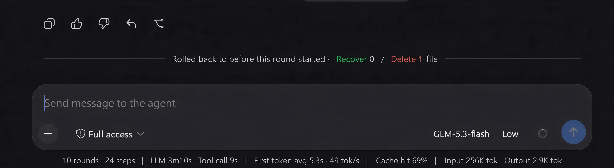

> 🌐 语言 / Language: [中文](./README.md) · **English**

# dsh-rollback · TRAE-style rollback plugin

A TRAE-style "roll back to before this turn" plugin for the [DeepSeek Harness](https://github.com/deepseek-ai/deepseek-harness) (DSH) Web client: it captures per-turn checkpoints and, with one click, rolls back **both workspace files and model context** to before a given turn while keeping the same session id.

## What it is

`dsh-rollback` faithfully implements the core idea behind TRAE's rollback — **rolling back conversation state and file state in lockstep**:

- Model behavior is driven by both the conversation history and the workspace files, so a rollback must roll back **both** at once; otherwise you get hallucination continuation or state conflicts.
- Rollback = restore the files touched in this turn and later (modified → write back the prior content, created → delete) + truncate the conversation history in place (same session id, so the model no longer sees the truncated content).

## Features

| Capability | Description |
| --- | --- |
| Per-turn checkpoints | A checkpoint is captured before each turn, recording only the files actually touched (Copy-before-Write prior content), not a full snapshot |
| 10-turn sliding window | Mirrors TRAE's "last 10 turns only"; checkpoints beyond the window are dropped |
| File rollback | Modified files are written back to their pre-turn content; files created this turn are deleted; unrestorable files are reported as skipped |
| In-place truncation | Rewrites the model context with a **`user/message` surface `replace`** — the same primitive the built-in `/compact` uses — taking effect the moment the rollback runs, keeping the same session id |
| Three entry points | The `rollback` model tool, the `/rollback` human command, and a Web rollback button on each finalized reply |
| Affected-file list | The Web button opens a dialog listing the files affected by this and later turns and their actions (restore/delete/skip); clicking a file opens it in the editor |

## Getting started

### Install

```sh
dsh plugin --profile web add @domitor-syh/dsh-rollback
```

Then restart `dsh web`. When running DSH from source:

```sh
pnpm dsh plugin --profile web add @domitor-syh/dsh-rollback
```

### Usage

1. **Web button**: a ↩ rollback button appears in the action strip under each finalized assistant reply, alongside the feedback buttons → opens the affected-files list → confirm to roll back.
2. **Human command**: type in the composer:
   - `/rollback list` — list the turns you can roll back to
   - `/rollback preview <n>` — preview the files affected when rolling back to before turn n (no execution)
   - `/rollback <n>` — roll back to before turn n
3. **Model tool**: the AI can invoke `rollback` on its own (pass `turn` plus optional `preview: true`).

## Interface preview

1. **Rollback button**: a ↩ button in the action strip under each finalized assistant reply (next to the feedback buttons).

   

2. **Rollback dialog & file-change notice**: clicking ↩ opens a confirmation dialog listing each affected file and its action — modified files are written back, created files are deleted (unrestorable ones are flagged "skip").

   

3. **Rolled-back messages hidden**: after confirming, the rolled-back messages are hidden immediately (no divider is rendered, and there is no trace on the model side either); the rolled-back turn's text/images return to the composer for further editing.

   

4. **Rolling back the first message**: when rolling back to before the first message, the chat shows a "rolled back to the start of the conversation" welcome page.

   

## Architecture

| File | Responsibility |
| --- | --- |
| `src/core/` | Pure logic (no DSH dependencies): checkpoint model, capture/merge, rollback planning, truncation planning, sliding window, session folding — all unit-test-covered |
| `src/service.ts` | Host-side execution: captures pre-write content via `tools/result` + folds turns via `session/event`; performs restore/delete/truncate |
| `src/index.ts` | Plugin body (host half): registers the `rollback` tool and the `/rollback` command |
| `src/client/index.ts` | Browser half: the rollback button on the official `assistant-actions` slot + affected-files dialog + localization, reaching the host through the shipped `commands` Remote |

Key implementation points:

- **Pre-content capture**: `write`/`edit` tool results already carry `before`/`after`; the full prior content is taken through `ctx.on('tools/result')` (the session log only keeps 3-line context diffs, which can't reconstruct a file — so the live result is required).
- **In-place truncation**: for the consecutive nodes in `session.surface.nodes` from turn n onward, it appends a **`user/message`** surface `replace` (`surfaceOp: { op:'replace', start, end }` + `sourceEventSeqs` covering every shadowed node), replacing that span of history in place; the session id is unchanged.
  - **It borrows the harness's own tool**: DSH rewrites model-visible history exactly this way itself — the built-in `/compact` checkpoint (`compaction-basic`) and `tool-result-pruner` both append a `user/message` with a positional `replace`. This is the official primitive, not a side channel.
  - **It lands as the rollback runs**: `user/message` is the one message-producing event the session invariant leaves unconstrained, so it may be appended **between turns** (no open turn, no open step). The marker therefore enters the log the moment `/rollback` executes — the rolled-back range hides immediately, the welcome hero appears immediately, and a page refresh does not bring the messages back.
  - **Why not an empty `assistant/message` (the model-invisible form)**: an empty assistant message does project to null, but DSH accepts it only **inside an open step**. There is no step between turns, and opening one is impossible: the sequential-step invariant requires the agent loop's own next number, so a step of ours would make the loop's own `step/start` fail and break the whole turn. Inventing a turn is worse: the plugin and the agent loop each track "the next turn number" independently, so a synthetic turn duplicates that number — two `turn/start` events with one turn — and the Web client then refuses to rebuild the conversation at all.
  - **The deliberate cost**: the model DOES see that checkpoint text. It is framed the way DSH frames its own compaction checkpoint — explicit about what it is, and instructing the model not to acknowledge it — so the model neither has to guess nor treat it as a task. The rolled-back content itself is **entirely absent** from the model's history (the surface `replace` removed it).
  - Regression tests: `tests/truncation-plan.test.ts` (including a guard that the marker must never go back to an `assistant/message` or any step-scoped shape).
- **Client transport**: no custom Typert build is introduced; it reuses the shipped `ctx.remote.commands.execute` to call `/rollback …`.

## Known limitations

- **The human chat log still shows rolled-back messages**: DSH's human chat log renders by append-origin events (the same as built-in compaction); a surface `replace` only truncates the **model context**. The plugin hides the rolled-back range at the UI layer, driven by the durable marker in the log — in force the moment the rollback runs, and preserved across refresh/restart. **No divider or rollback notice is rendered** (a welcome hero appears when a rollback empties the whole conversation).
- **The model sees one line of checkpoint text**: that is the price of "in force immediately and preserved across a refresh". The model-invisible form needs the marker inside an open step, which is impossible between turns (see "Why not an empty `assistant/message`" above). The text is the same kind of thing as a `/compact` checkpoint and explicitly tells the model not to acknowledge it; it costs roughly 60 tokens, and repeated rollbacks to before the first message keep only one (a newer marker's replacement range covers the older one).
- **Checkpoints are process-in-memory plus a 20-turn sidecar**: the session's fold state lives with the session object in memory (`WeakMap`) and is rebuilt from the sidecar on restart (`storages/dsh-rollback/checkpoints-v2/`) — `seedFromLog` replays the log and restores historical checkpoints with their full prior content from the sidecar, keeping the most recent 20 turns (`KEEP_TURNS`); records beyond that window are pruned at load.
- **Created-file deletion goes through the local filesystem**: the filesystem abstraction has no delete primitive; deletion uses `processPath` + Node `unlink`, which is only reliable for the local backend.
- **Rollback is irreversible**: executing truncates, consistent with TRAE semantics, with no redo chain; the affected-files preview in the dialog compensates for this risk.
- **Command side effects are out of scope**: `npm install`, database writes, network requests, and other external side effects cannot be rolled back (the inherent boundary of every checkpoint approach).

## Development

```sh
pnpm install    # install deps (prepare also builds once)
pnpm build      # emit lib/index.js, lib/invariant.js, lib/client.js from src/
pnpm test       # run the dependency-free core unit tests
pnpm typecheck  # type-check core and tests
```

## License

[MIT](./LICENSE)