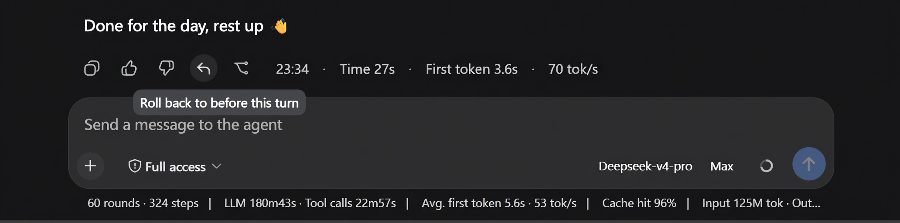
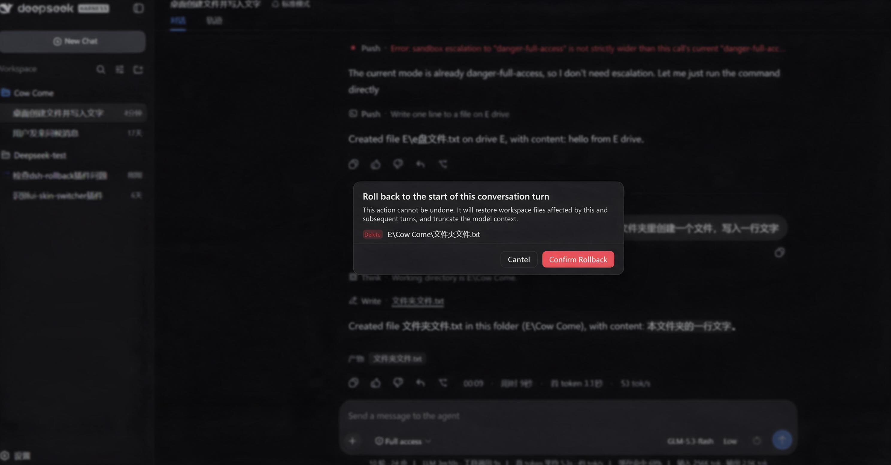
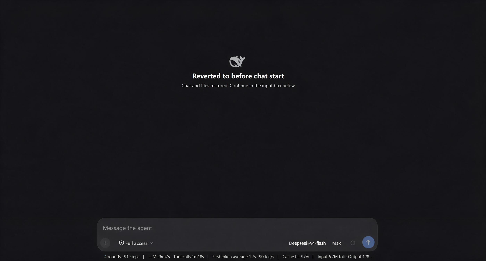

> 🌐 语言 / Language: [中文](./README.md) · **English**

# dsh-rollback · TRAE-style rollback plugin

A TRAE-style "roll back to before this turn" plugin for the [DeepSeek Harness](https://github.com/deepseek-ai/deepseek-harness) (DSH) Web client: it captures per-turn checkpoints and, with one click, rolls back **both workspace files and model context** to before a given turn while keeping the same session id.

## What it is

`dsh-rollback` faithfully implements the core idea behind TRAE's rollback — **rolling back conversation state and file state in lockstep**:

- Model behavior is driven by both the conversation history and the workspace files, so a rollback must roll back **both** at once; otherwise you get hallucination continuation or state conflicts.
- Rollback = restore the files touched in this turn and later (modified → write back the prior content, created → delete) + truncate the conversation history in place (same session id, so the model no longer sees the truncated content).

## Features

| Capability | Description |
| --- | --- |
| Per-turn checkpoints | A checkpoint is captured before each turn, recording only the files actually touched (Copy-before-Write prior content), not a full snapshot |
| 10-turn sliding window | Mirrors TRAE's "last 10 turns only"; checkpoints beyond the window are dropped |
| File rollback | Modified files are written back to their pre-turn content; files deleted since are brought back; files created this turn are deleted; unrestorable files are reported as skipped |
| In-place truncation | Rewrites the model context with a **`user/message` surface `replace`** — the same primitive the built-in `/compact` uses — taking effect the moment the rollback runs, keeping the same session id |
| Two entry points | The `/rollback` human command, and a Web rollback button after every turn (on the reply's action strip for a normal turn, in the turn footer for an interrupted one) |
| Affected-file list | The Web button opens a dialog listing the files affected by this and later turns and their actions (restore/recover/delete/skip); clicking a file opens it in the editor |
| No rollback while running | Any open turn refuses a rollback outright; wait for the turn to end or pause it (a running turn has no button to press anyway) |

## Getting started

### Install

```sh
dsh plugin --profile web add @domitor-syh/dsh-rollback
```

Then restart `dsh web`. When running DSH from source:

```sh
pnpm dsh plugin --profile web add @domitor-syh/dsh-rollback
```

### Usage

1. **Web button**: a ↩ rollback button appears in the action strip under each finalized assistant reply, alongside the feedback buttons → opens the affected-files list → confirm to roll back.
2. **Human command**: type in the composer:
   - `/rollback list` — list the turns you can roll back to
   - `/rollback preview <n>` — preview the files affected when rolling back to before turn n (no execution)
   - `/rollback <n>` — roll back to before turn n
3. **No model tool**: a model-invoked rollback would always happen while a turn is running, and a running turn refuses every rollback — so the tool cannot exist. A rollback is always started by a human.

## Interface preview

1. **Rollback button**: appears after every turn — in the reply's action strip for a normal turn (next to the feedback buttons), and in the **turn footer** for an interrupted one (that turn has no closing reply, so the strip cannot carry a button). While a turn is running the button stays and greys out.

   

2. **Rollback dialog & file-change notice**: clicking ↩ opens a confirmation dialog listing each affected file and its action — modified files are written back (`restore`), deleted files are brought back (`recover`), files created this turn are deleted (`delete`), and unrestorable ones are flagged "skip".

   

3. **Rolled-back messages hidden**: after confirming, the rolled-back messages are hidden immediately (no divider is rendered in the UI); the rolled-back turn's text/images return to the composer for further editing.

4. **Rolling back the first message**: when rolling back to before the first message, the chat shows a "rolled back to the start of the conversation" welcome page.

   

## Architecture

| File | Responsibility |
| --- | --- |
| `src/core/` | Pure logic (no DSH dependencies): checkpoint model, capture/merge, rollback planning, truncation planning, sliding window, session folding — all unit-test-covered |
| `src/service.ts` | Host-side execution: captures pre-write content via `tools/result` + folds turns via `session/event`; performs restore/delete/truncate |
| `src/index.ts` | Plugin body (host half): registers the `rollback` tool and the `/rollback` command |
| `src/client/index.ts` | Browser half: the rollback button on the official `assistant-actions` slot + affected-files dialog + localization, reaching the host through the shipped `commands` Remote |

Key implementation points:

- **Pre-content capture**: `write`/`edit` results already carry `before`/`after`, read through `ctx.on('tools/result')`; `str_replace_editor` returns only rendered text, so its target is read ahead of the call in `tools/pre-execute`.
- **Drive-root fallback**: on Windows the file tools cannot touch a file directly under a drive root — the filesystem layer pre-creates the parent directory, `dirname('E:\\file.txt')` is `E:\` **with its trailing separator**, and Windows answers a mkdir on a volume root with EPERM. The plugin wraps `ctx.fs.writeText` and `ctx.fs.editText`: **only when the original path throws exactly that error shape** does it land the bytes as a sibling temp file plus a `rename`, with no mkdir preflight. The edit branch also reproduces the provider's literal-match semantics word for word (the `FS_EDIT_NOT_FOUND` / `FS_AMBIGUOUS_EDIT` decisions and messages) and keeps the original file's **line-ending style** and permission bits; only methods the mounted backend actually implements are wrapped. Every other error, and any target the policy does not permit (fail closed), is rethrown untouched. If the filesystem layer stops pre-creating the directory, this branch becomes unreachable and retires itself.
- **Empty-directory cleanup**: after a rollback deletes the files it created, the ancestor directories that are now empty AND whose creation time falls inside the rolled-back span are removed too (deepest first; children this same pass is about to remove count as already gone, so a whole new directory chain goes together). The creation time is what separates two cases: with a directory made in turn 3 and a file made in turn 5, rolling back to before turn 5 **deletes the file and keeps the directory**, while rolling back to before turn 3 **removes both**. An unknown creation time, an unreadable directory, or any remaining content keeps the directory (fail closed).
- **Boundary re-scan with last known content**: capture only ever sees the file tools, so the plugin re-checks the paths it has watched **when each turn ends (and again when a user message arrives)** — a stat-only fast path while the fingerprint is unchanged — and records what a shell command rewrote or removed **against that turn**. A deletion is therefore already recorded the moment the turn that made it ends, with **no further message needed**, and rolling back to before that turn restores the file (a rollback waits for a scan still in flight, so asking the instant the turn ends cannot miss it). The decisions fail closed: a file that vanished before the plugin ever read it is **not recorded** (recording it would surface only as an unrestorable path, and any unrestorable file aborts the whole rollback) but warned about once; a file above 8 MiB stops being watched instead of pretending to be restorable; and after a rollback the registry drops only what it learned about the contents, **keeping the paths watched** so coverage is not quietly lost.
- **Write-preference hint**: one always-on runtime context line tells the model that only files touched by `write`/`edit` are tracked for rollback, so file contents should be changed with those tools rather than a shell command.
- **In-place truncation**: for the consecutive nodes in `session.surface.nodes` from turn n onward, a **`user/message`** surface `replace` (`surfaceOp: { op:'replace', start, end }` + `sourceEventSeqs` covering every shadowed node) is appended, replacing that span of history in place; the session id is unchanged.
  - The marker enters the log the moment `/rollback` runs, so the rolled-back range leaves the model's history immediately.
  - Its content is an automatically generated checkpoint notice that tells the model not to acknowledge it; rolling back to the same point again lets the newer marker's range cover the older one, leaving a single marker.
- **UI hiding**: the client hides the chat seats inside the rolled-back range (`display: none`), driven by the durable marker in the log, so the hiding survives a refresh or restart.
- **Four rollback tags**: `restore` (the file is still there; old content goes back · green), `recover` (the file was deleted; it is brought back · blue), `delete` (undo a file this span created · red), and `skip` (cannot be restored). The first three are distinguished by the recorded kind (`updated` / `removed` / `created`), so writing content back and bringing a file back are two different things in the data itself. An empty list no longer claims there were no file changes: the plugin cannot see files a shell command wrote directly, so it does not make that promise.
- **Two placements, one button per turn**: a normal turn keeps its button on the **assistant action strip**, where it has always been; only an **interrupted** turn (no closing reply, so the strip cannot carry a button) gets one in the **turn footer**. The footer entry is a contribution to the official `conversation.chat.turnTail` slot, which is a **chain** slot: an entry MUST supply `select`, and returning null means "do not render" — which is exactly how "only where the strip cannot" is implemented. The registration is guarded and reports itself in the console, so a silently missing button cannot happen again.
- **No rollback while a turn runs**: an open turn refuses a rollback entirely (`src/core/rollback-guard.ts`), whatever the target turn. The agent loop holds a position in the model-visible surface and keeps appending, so truncating underneath it would shadow history the turn is still writing while its later output stays; a command does not interrupt the run either, so the refusal itself is what keeps the two from interleaving. A running turn simply has NO button (the footer node only exists once its turn ends, and the action strip only once a reply finalizes), so there is one rule here and no second disabling mechanism.
- **Welcome hero**: once a rollback has emptied the whole conversation, the driver injects a host element into the transcript and portals the hero into it.
- **Client transport**: reuses the shipped `ctx.remote.commands.execute` to call `/rollback …`.
- **Regression tests**: `tests/core.test.ts` (35), `tests/truncation-plan.test.ts` (10), `tests/root-write.test.ts` (14), `tests/root-write-fallback.test.ts` (15), `tests/literal-edit.test.ts` (12), `tests/dir-cleanup.test.ts` (15), `tests/empty-dirs.test.ts` (5), `tests/boundary-scan.test.ts` (10), `tests/boundary-rescan.test.ts` (13), `tests/boundary-pipeline.test.ts` (5), `tests/rollback-guard.test.ts` (10), and `tests/turn-entry.test.ts` (3).

## Known limitations

- **An unrestorable file is SKIPPED, not a reason to abort the whole rollback**: when a file cannot be put back (its pre-turn content was never recorded, or the filesystem refused — locked, no permission, a sandbox that disallows restoring outside the workspace), the plugin does what it can, **truncates the conversation anyway**, and lists what it skipped. That is a deliberate trade: aborting everything left files partly restored, the conversation untruncated, and the blocking cause (often permanent) failing identically on every retry — stranding the user. The skipped entries are marked 跳过 in the preview BEFORE confirming, so the cost is known, and their records are KEPT so a later rollback tries again (a released file lock then just works).
- **A target beyond the retained range is refused**: checkpoints are a 10-turn sliding window and older state cannot be rebuilt. In the UI those entries are greyed out (the greying IS the explanation — no extra tooltip), and the command reports the available range — previously such a target **silently restored from the oldest retained records** (the wrong state, with nothing said).
- **The chat trail still keeps rolled-back messages**: DSH renders that trail from append-origin events, and the log itself is append-only, so a surface `replace` only affects the **model context**. The plugin hides the rolled-back range in the UI, driven by the durable marker in the log (preserved across refresh/restart).
- **The model reads one line of checkpoint text**: a marker the model cannot see cannot be written between turns (that needs an open step), so the model reads the checkpoint notice — roughly 60 tokens. The notice itself tells the model to treat what remains as established background, continue from the messages that follow, and **not to mind or acknowledge the checkpoint**.
- **Checkpoints are process-in-memory plus a 20-turn sidecar**: the fold state lives with the session object in memory (`WeakMap`); after a restart it is rebuilt from the sidecar (`storages/dsh-rollback/checkpoints-v2/`), which keeps the most recent 20 turns (`KEEP_TURNS`) and prunes older records at load.
- **Created-file deletion and empty-directory cleanup go through the local filesystem**: the filesystem abstraction has no delete primitive; deletion uses `processPath` + Node `unlink`, and the directory cleanup uses Node `rmdir`, both reliable only for the local backend.
- **Rollback is irreversible**: it replaces history in place and offers no redo.
- **Files a shell command creates, and files no file tool ever touched, are out of scope**: the plugin captures changes only from `write`/`edit` results and re-checks those paths at message boundaries — so a shell command that rewrites or deletes a **tracked** file (anywhere on disk, including outside the workspace) **can** be rolled back, while a brand-new file written by a shell command, or a change to a file no tool ever touched, cannot (the plugin does not even know the latter existed). The plugin injects a hint steering content changes to the file tools, but it cannot enforce that.

## Development

```sh
pnpm install        # install deps (prepare also builds once)
pnpm build          # emit lib/index.js, lib/invariant.js, lib/client.js from src/
pnpm test           # run the dependency-free core unit tests
pnpm typecheck      # tsc over core + tests, then scripts/typecheck-host.mjs over
                    #   src/service.ts, src/index.ts, src/client/index.ts
                    #   (the @deepseek-ai/* packages they import are not installed
                    #     here, so only the TS2307/TS7006/TS7016 those absences
                    #     cause are ignored; everything else fails — including
                    #     TS2304, an undefined identifier)
pnpm deploy:profile # pack and deploy into the DSH profile (default "web");
                    #   restarting DSH afterwards is still up to you
```

> ️ **Editing code requires `pnpm deploy:profile`**: DSH does not load this plugin from this
> repository — it loads the copy a package manager extracted into the profile's `node_modules`
> from the `file:` tarball (see the header of `scripts/deploy-profile.mjs`). Running `pnpm build`
> alone only changes this repository's `lib/`, so the runtime is unchanged. The script packs,
> refreshes both the referenced tarball and the extracted copy, verifies they match the build,
> and then reminds you of the one step it cannot take: **restarting DSH**, because the host half
> is loaded at startup and a running process keeps the code it booted with.

## License

[MIT](./LICENSE)