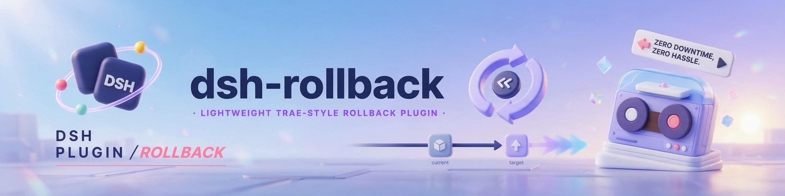

<div align="center">

# dsh-rollback · TRAE-style rollback plugin



[中文](./README.md) · English

[](https://awesome-dsh-plugin.com) [](https://awesome-dsh-plugin.com) [](https://www.npmjs.com/package/@domitor-syh/dsh-rollback) [](https://www.npmjs.com/package/@domitor-syh/dsh-rollback) [](./LICENSE) [](https://github.com/domitor-syh/dsh-rollback/actions/workflows/test.yml)

</div>

Turn-based rollback for the [DeepSeek Harness](https://github.com/deepseek-ai/deepseek-harness) (DSH) Web client: restore tracked file changes and withdraw the corresponding model-visible conversation while keeping the same session.

## Features

- **Turn-based rollback**: choose from the latest 10 retained checkpoints using a button or `/rollback`.
- **Files and conversation together**: restore previous content, recover deleted files and undo file creation; files with equal initial and final states are left untouched.
- **Confirm before execution**: review affected files and external-change warnings in the dialog.
- **Draft restoration**: the confirmation flow attempts to put the original message and recoverable attachments back into the composer.
- **Recovery progress retained**: retry after failure or attempt compensation of file operations.

## Install

```sh
dsh plugin --profile web add @domitor-syh/dsh-rollback
```

Restart `dsh web` and refresh the page after installation. When running DSH from source, prefix the command with `pnpm`.

On the desktop build the same package installs through its own official channel: enter **`@domitor-syh/dsh-rollback`** where the desktop app installs plugins (equivalently, `dsh plugin --profile desktop add @domitor-syh/dsh-rollback`), then restart the desktop app.

The current target is **DSH 0.2.0-rc.2**. The declared compatibility range is `>=0.1.5-rc.2 <0.2.0-0 || >=0.2.0-rc.2 <0.3.0-0`; check compatibility for other builds.

## Usage

There are three ways to use the plugin:

1. **Rollback button**: click **Rollback** on an ended turn → review affected files → confirm rollback.
2. **`/rollback`**: enter `/rollback` without arguments → open the turn picker → choose a target turn → review affected files and confirm rollback.
3. **`/rollback` + Space**: type `/rollback` and press Space → open the subcommand menu → select a command or arguments → press Enter to execute. Selecting a menu item only completes arguments; it does not execute immediately. `preview` opens a turn submenu; press Esc to return.

| Command | Purpose |
| --- | --- |
| `/rollback` | Choose a turn and open the confirmation dialog |
| `/rollback latest` | Directly roll back the latest checkpoint |
| `/rollback <n>` | Directly roll back to before turn n |
| `/rollback list` | List available turns |
| `/rollback preview <n>` | Preview affected files |
| `/rollback retry` | Continue an unfinished recovery |
| `/rollback abort` | Attempt file compensation before conversation withdrawal is committed |
| `/rollback rescues` | List file rescue points without restoring them |
| `/rollback state` | Show the current rollback state |
| `/rollback diagnose` | Show diagnostics |

**`latest` and numeric commands execute directly without a confirmation dialog.** Use the interface or `preview` to inspect changes first.

Rollback is unavailable while a turn is running. It covers tracked files with restore evidence, not a full workspace backup; external-change warnings mean that related content may be overwritten. After recovery fails, follow the instructions for `retry` or `abort`: an error does not mean file operations were automatically undone. Abort is unavailable once conversation withdrawal is committed. Rollback does not erase original session logs.

## Development

The build toolchain requires Node `^22.18.0 || >=24.11.0`.

```sh
pnpm install
pnpm typecheck
pnpm test
pnpm check:readmes
pnpm build
```

Install the build artifacts into the target profile, then restart DSH and refresh the page. See the [changelog](./CHANGELOG.md) for version history.

## License

[MIT](./LICENSE)
