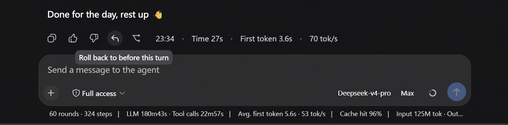
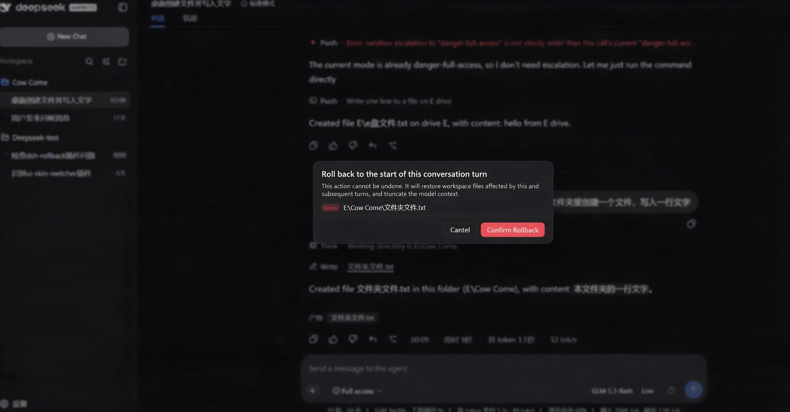
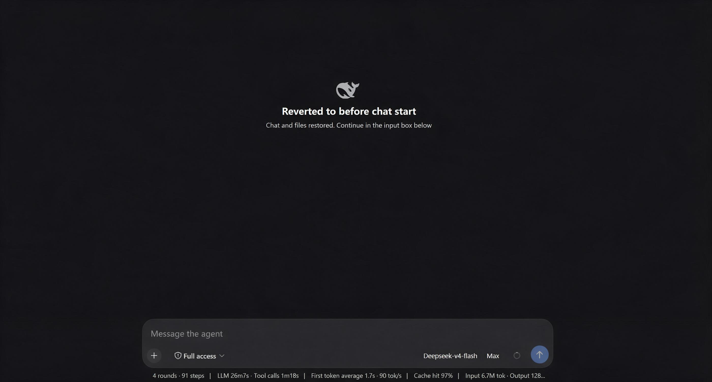

<div align="center">

# dsh-rollback · TRAE-style rollback plugin


> 🌐 语言 / Language: [中文](./README.md) · **English**

[](https://awesome-dsh-plugin.com) [](https://awesome-dsh-plugin.com) [](https://www.npmjs.com/package/@domitor-syh/dsh-rollback) [](https://www.npmjs.com/package/@domitor-syh/dsh-rollback) [](./LICENSE) [](https://github.com/domitor-syh/dsh-rollback/actions/workflows/test.yml)

</div>

A TRAE-style "roll back to before this turn" plugin for the [DeepSeek Harness](https://github.com/deepseek-ai/deepseek-harness) (DSH) Web client: it captures per-turn checkpoints, restores **tracked files with a restore basis and current policy/backend support**, then replaces the corresponding model-visible history while keeping the same session id. It is not a full workspace snapshot or general backup tool. The implementation remains **Unreleased**; deployment or live-GUI end-to-end validation is not claimed.

## What it is

`dsh-rollback` aims to **align tracked-file state with model-visible conversation state**:

- Model behavior depends on both history and files; truncating history while leaving unresolved file changes creates a state conflict.
- Planning distinguishes writing back prior content, undoing creation and recovering deletion before replacing history in the same session id. Execution requires complete restore evidence and current policy/backend authorization. Existing regular text files can be restored, restricted local regular files deleted, and missing files recovered when compensation deletion is authorized (see limitations).
- Execution is **all-or-no-truncate**: incomplete preflight prevents it from starting; failed restore I/O does not proceed to truncation, but files may already be partly changed and need durable-journal retry or compensation. This is not an atomic transaction across multiple files.

## Supported DSH versions

The package version remains **0.4.0**; the safety revisions in this working tree are **Unreleased**. The table separates version-gate admission from historical validation: older test records do not establish that these unreleased revisions passed on a real desktop runtime, and installing the npm package does not automatically include working-tree changes.

| DSH version | Status | Notes |
| --- | --- | --- |
| 0.2.0-rc.2 | Historical release validation target | The 0.4.0 history records the `conversation.chat.turnTail` list/`id` adaptation and the `plugin:rollback` marker-source correction; this does not establish fresh desktop end-to-end validation of the safety revisions |
| 0.1.5-rc.2 | Historical validation record | Earlier releases record file restore, truncation, hiding and image re-attach tests; old-contract fallbacks remain, but that does not mean the current safety revisions were re-verified on this build |
| Other builds inside the declared range | May be admitted, not verified | Host services, events, session persistence and client slot contracts need build-specific verification; admission is not a restore-safety guarantee |
| 0.1.1-rc.2 and other builds below the lower bound | Not admitted by the current declaration | Legacy reading branches do not constitute a current support promise; consult the historical changelog for older package choices |
| 0.2.0-rc.1, and the 0.3.0 line or later | Not admitted by the current declaration | Do not treat a version exemption as evidence of safe compatibility |

`dsh.engines.dsh` in `package.json` and the DSH peer ranges are all `>=0.1.5-rc.2 <0.2.0-0 || >=0.2.0-rc.2 <0.3.0-0`. The current DSH loader checks `@deepseek-ai/dsh`, `@deepseek-ai/dsh-session` and `@deepseek-ai/dsh-invariants` in `peerDependencies` against the runtime version with `semver.satisfies(runtimeVersion, range, { includePrerelease: true })`; `dsh.engines.dsh` is corresponding metadata only. The two clauses cover the declared version lines, and `<0.2.0-0` / `<0.3.0-0` exclude the next line's prereleases.

On an unknown chat shape or invalid state, the client should stop hiding and report a diagnostic rather than guess. That is not a promise that unfamiliar runtimes can cause only cosmetic problems: rollback also depends on host persistence, file policy and backend capabilities. This document **does not claim that these changes have been published to npm, deployed to a profile, or end-to-end validated in the running GUI**.

## Features

| Capability | Description |
| --- | --- |
| Per-turn checkpoints | Folds observed file changes around turns and keeps complete prior content; not a full snapshot |
| 10-turn sliding window | Targets are limited to the recently retained turns; recovery journals are retained independently of that window |
| File rollback | Restore regular text files with a complete basis; deletion and missing-file recovery require restricted local-delete authorization; known unrestorable entries still block the entire execution at preflight |
| In-place truncation | After all planned file restores complete, append a `user/message` surface `replace` and wait for host persistence confirmation, keeping the same session id |
| Two entry points | The `/rollback` human command and a Web button on ended turns (reply action strip for a normal turn, footer for an interrupted turn) |
| Affected-file list | Read-only paths, actions and conflict notices; "skip" identifies an unrestorable entry that blocks execution rather than being ignored; a content-conflict warning alone no longer refuses authorized operations |
| No rollback while running | Any open turn refuses rollback; historical buttons are disabled while running and the current turn has no ended-turn button yet; a pending recovery transaction blocks model and tool execution |

## Getting started

### Install

```sh
dsh plugin --profile web add @domitor-syh/dsh-rollback
```

Then restart `dsh web`. When running DSH from source:

```sh
pnpm dsh plugin --profile web add @domitor-syh/dsh-rollback
```

### Usage

1. **Web button**: ↩ on an ended turn → read affected files and session version → confirmation dialog → execute. File rows are a read-out, not navigation controls.
2. **Human command**: type `/` and choose `/rollback`, or use the argument-free command → the official **turn picker** → choose a target → **confirmation dialog**. Selecting a turn neither inserts composer text nor executes immediately.
   - Type `/rollback` and press Space: once the blue command is claimed, a subcommand completion menu shows actual commands as titles and explanations beneath. Selecting only appends arguments and preserves the claim; press Enter afterward to execute. Preview opens a turn submenu; Esc returns with preview selected. The original picker contains only the previous-turn shortcut and turn rows.
   - `/rollback latest` directly execute the newest retained checkpoint; the current DSH decoration API cannot intercept argument-bearing lines to open a confirmation dialog, so this command has the same no-confirmation behavior as numeric commands. With no rollbackable turn, it returns an error without changing files or conversation.
   - Read-only helpers: `/rollback list` lists turns, `/rollback preview <n>` previews tracked files and version, `/rollback state` reads bounded, session-bound rollback state, `/rollback rescues` lists persisted files-only rescue metadata and paths (it does not restore files), and `/rollback diagnose` reports content-free diagnostics (journal phase, checkpoints, policy and method presence); none restores files. Diagnose does not probe deletion/local mapping or treat method presence as verified restore capability; failed scans/observations still return sanitized diagnostics without clearing the failure, and unavailable lookups report unknown.
   - After I/O or persistence failure: `/rollback retry` continues the pending transaction; `/rollback abort` **attempts** compensation to actual pre-operation state only before marker append, retaining the conversation if successful. Authorized content conflicts alone no longer block execute/retry/abort, but file-type, path, policy, session, WAL and supported read-to-write version guards remain. Missing capabilities or failed guards retain the journal; cancellation is not guaranteed. Once a marker is written, only retry can finish persistence. Retrying a `committed` journal performs cleanup, not another file restore. Recovery does not depend on the target remaining in the 10-turn picker window.
3. **No model tool**: rollback is always human-initiated; a model call would occur during an open turn, conflicting with the running-turn prohibition.

The dialog's preview and submission are bound to one session and version; a changed session requires a fresh preview. Stale requests must not overwrite a newer session/dialog, and closing is disabled during execution. Closing a dialog is not cancellation of a host recovery transaction.

## Interface preview

1. **Rollback button**: on ended turns, a normal turn uses the reply action strip (next to feedback); an interrupted turn with no closing reply uses the footer. Historical buttons are disabled while running; the current unfinished turn has no ended-turn button yet.

   

2. **Rollback dialog & file-change notice**: clicking ↩ opens a confirmation dialog listing `restore`, `recover` or `delete`; "skip" blocks the entire execution. Affected file actions carry a slowly blinking yellow dot, static under reduced motion. The exact bottom Chinese warning is "警告:检测到文件有人为/外部应用修改痕迹，请谨慎回退". It signals modification traces, not reliable actor attribution. Screenshots illustrate historical UI, not validation of these revisions.

   

3. **Rolled-back message hiding**: after a successful host commit and valid bounded state for the matching session, the client hides confirmed withdrawn messages without a divider. The confirmation flow attempts to re-attach text/reconstructable attachments; historical-byte re-attachment of ordinary files is implemented, not a promise to restore every attachment.

4. **Rolling back the first message**: the "rolled back to the start of the conversation" welcome page appears only when valid bounded state for the matching session confirms that boundary. Unknown or stale state does not authorize covering the current conversation.

   

## Architecture

| File | Responsibility |
| --- | --- |
| `src/core/` | DSH-independent checkpoints, capture/merge, restore/truncation planning, log replay and UI identity rules, with unit coverage for the corresponding rules |
| `src/service.ts` | Host-side file-tool and session observation, queued-scan waits, version checks, preflight, restore/compensation and truncation commit |
| `src/store.ts` | Complete prior-content sidecars, session-isolated records and independent post-rollback baselines |
| `src/transaction-store.ts` | Independent durable recovery journal containing restore targets and actual pre-operation file states |
| `src/index.ts` | Host entry: required services are `fs`, `sessions`, `commands`, `sandboxPolicy` and `attachments`; registers the human `/rollback` command, not a model tool |
| `src/client/index.ts` | Web entry: required services are `slots`, `remote`, `remote.commands` and `locale`; buttons, turn picker, confirmation and UI state request the host through `ctx.remote.commands.execute`; automatic read-only queries carry `--internal`, so their receipts are not shown as history commands while user-entered read commands remain visible |

Key implementation points:

- **Prior-content capture**: `write`, `edit` and `str_replace_editor` pre-read in `tools/pre-execute`, then discard the stale preimage and refresh actual existence/content in approved-dispatch `tools/execute`, covering approval waterfall bypass and changes during approval. A successful mutation missing trustworthy capture prohibits rollback rather than trusting reported placeholder `before: ""`; valid empty content remains valid. Observers need no required `tools` injection. Capture/persistence failures prohibit rollback without swallowing downstream tool errors.
- **Drive-root fallback**: the Windows fallback on `ctx.fs.writeText` and `ctx.fs.editText` applies only to an exact drive-root mkdir EPERM and still needs the policy and backend conditions to hold. Successful original-provider calls receive guards unchanged. Native rename cannot provide conditional publication, so guarded creates/replacements and guarded edits refuse the fallback rather than degrade to unconditional overwrite. Rollback restoration uses version guards; this error retains the recovery journal and prevents further truncation. It is not a replacement route for general file errors or proof of local-path mapping on every backend.
- **Directories retained**: transaction execution does not automatically clean ancestor directories based on birthtime. A timestamp does not prove that the rolled-back turn created a directory; empty directories may remain.
- **Dispatch-scoped capture and external-change ownership**: user messages and turn end no longer attribute disk differences to the current turn; text-only and known read-only tool turns do not list files for those differences. External changes remain conflicts on the last actual file-changing turn, without overwriting its after-state or adding a checkpoint. Successful `write`/`edit`/editor results capture only the target path; unchanged content adds no mutation. Shell/unknown tools use independent pre/post snapshots of registered paths, including pre-dispatch user edits in the restore basis. Direct tools that partially write then fail, or commit before post-processing rejects/cancels, record actual changes from captured target pre/post states; only the declared target is owned, not unrelated paths. Preview/execution wait for observations; permissions/I/O errors, non-regular files, limits, races and unproven local mapping still fail closed. Background/detached changes and external writes concurrent with tools cannot be reliably attributed. Historical misattributions have no provenance and are not automatically migrated.
- **Late results and replay completeness**: direct-file success is anchored to its original dispatch turn even when that turn has ended. Editors without structured postimages use the target state already captured at dispatch completion, including no-ops; result callbacks do not re-read and absorb later external writes. New receipts persist `callId`, and replay checks coverage per turn/call so another file's checkpoint cannot hide missing evidence. An implicit next-turn start first merges the interrupted previous turn's durable mutations; direct mutators with neither a final result nor an exact receipt refuse rollback. Legacy identity-less receipts are supported only without mixed shell/unknown mutators, with exact recorded paths and enough raw receipts, without guessing relative paths or inventing preimages; this is not proof of historical actor attribution. Repeated identical mutations within one raw file remain distinct; deduplication uses explicit identities or counted legacy/primary migration copies only.
- **Net-change attribution across a target span**: for each path, keep only the first `before` and final `after`; missing before/present final means delete, present before/missing final means recover, and differing present endpoints mean restore. Equal endpoints—including create-then-delete and update-then-revert—are omitted from both the file list and actual I/O, even if a later external edit occurs. External-only paths are never added, and existing conflict checks remain on net-affected paths. An optional WAL action preserves preview labels for retry after external edits; a missing legacy `after` cannot prove net zero, so the conservative old-kind restore is retained. The accepted Hero/menu/rail behavior is unchanged; concurrent external edits during an unknown shell dispatch still cannot be distinguished reliably.
- **Files-only rescue points**: after a committed rollback and before WAL cleanup, an independent `rescues-v1` point stores the transaction's real before/after states. Same-id/same-payload retries are idempotent; conflicts, corruption and count/size/version overflows reject replacement and retain the WAL. A rescue point is not full conversation redo, provider KV/remote-memory erasure or attachment backup.
- **Post-rollback baselines**: every successfully restored or compensated path gets exact content/confirmed absence through `resetAfterRollback`, persisted independently so dead-turn filtering cannot erase it. Keeping a path or forgetting its content alone does not preserve safe tracking; later restore still depends on valid records, retention and a usable backend.
- **Recovery transaction and conflict preview**: execution is exclusive per session and requires matching preview/submission versions. Unknown prior content, unrestorable entries and unauthorized deletion/compensation deletion reject preflight. Preview compares live content with the last recorded after-state and, when available, the last successful tool version. Version memory is in-memory only, not reliable actor attribution; unseen edits, same-content edits and restart gaps can escape detection. Authorized content conflicts alone no longer refuse execute/retry/abort. Actual states and WAL are saved before restoration; supported writes retain read-to-write version guards. Failures retain the journal and block model/tools on mixed state. Disposal stops further work, and a cross-instance in-process lock prevents recovery until the old execution exits. This is not a multi-file atomic transaction. POSIX journals sync directory entries; Windows supports process-crash recovery without a sudden-power-loss durability promise.
- **In-place truncation and persistence**: after file restore completes, append a `user/message` event with `plugin:rollback` source to replace the corresponding model-visible history through a surface `replace`, using `startSeq`/`endSeq` and falling back to legacy `start`/`end` only on an explicit shape rejection. `sourceEventSeqs` cites shadowed nodes and the system prompt is excluded from the replacement range. `sessions.flush` must return `true` before execution and after marker append; notified observers are not a durability barrier. An already withdrawn target is refused.
- **Context-pressure pricing**: optionally read `ctx.get('tokenMeter')`, validate the exact positional surface span, sum fixed `heuristicTokens`, and synchronously append adjacent `compaction/prune` plus marker to correct usage-anchored projected pressure, not routed image prices. Missing, throwing or misaligned measurements use the existing marker-only path; append failures retain the journal. Real pinned rc.2 codec/meter in-memory regressions verify this protocol, not every admitted version or the live GUI. This neither restores KV caches nor erases memory.
- **Bounded UI state**: `/rollback state` returns `sessionId`, `version`, withdrawn turns and finite sequence ranges, not a boundary extending from one turn to infinity. Only matching-session, non-stale state plus official `data-chat-turn` / node identity authorizes row hiding. Unknown rows remain visible and new turns are not hidden by an old numeric boundary. Automatic client reads use an explicit `--internal` marker on `list`/`state`/`preview`; only marked internal command receipts are hidden, while user-entered read commands remain visible. React-owned message nodes are not removed.
- **The right-hand turn ladder is untouched**: keep the host's turn projection and layout; do not hide, delete or rearrange ladder marks. Shadowing a conversation does not delete turns from the append-only log.
- **Button slots**: normal turns use `conversation.chat.assistant-actions`; turns without a closing reply use `conversation.chat.turnTail`. Footer registration tries the current list/`id` shape first and the historical chain/`select` only after an explicit shape rejection. Both routes show it only when the action strip cannot.
- **Run and dialog guards**: any open turn refuses rollback (`src/core/rollback-guard.ts`) and historical buttons are disabled while running. Dialog reads carry request identity, invalidated on session switch/close; execution disables closing and duplicate confirmation, and submits the preview version.
- **Welcome hero and draft re-attach**: valid matching-session state must confirm rollback to the start with no remaining effective visible content. Explicitly hidden receipts/projection nodes, official non-rendering permission/ordinary context/system nodes and empty rollback-marker DOM wrappers do not block a valid empty projection; the Hero mounts only in the outer chat flow. Visible older/newer messages, manual read-only receipts and unknown content still block it. Button/confirmation flows attempt text and reconstructable attachments; direct numeric commands do not re-attach. Ordinary-file re-attachment is implemented: a Host command bounded by turn and attachment id returns exact historical bytes, rebuilt through `conversation.createDrafts` as binary `application/octet-stream` on the normal upload path, without receipt reuse or current source-path reads. Caps are 8 MiB per file and 32 MiB client aggregate. Unsupported legacy APIs and storage/upload failures are diagnosed; images are not guaranteed to bypass pre-upload normalization. The pinned host persists command result text in `command/done`, so bounded export duplicates attachment bytes as base64 in the durable session log; this receipt is log-only, not the model-visible surface. Hiding internal receipts does not delete those bytes; consider storage growth and privacy when sharing or exporting logs.
- **Regression validation**: `pnpm test` covers capture/merge, replay, baselines, scans, recovery transactions, truncation and client identity/request rules; `pnpm typecheck` checks core, tests and DSH interfaces. Current test output is authoritative, not a fixed file/case inventory. Simulated DOM, probes and unit tests are not live-GUI end-to-end validation.

## Known limitations

- **Failure is not proof of safe restoration**: unrestorable entries still block preflight. Failure after I/O begins may leave some files changed with history untruncated. Handle `/rollback retry` or `/rollback abort` first; an error does not mean writes were undone. Authorized content conflicts alone no longer refuse overwrite, but type/path/policy/session/WAL and supported version guards can still refuse unsafe operations. Abort is not allowed after marker append.
- **Local deletion has authorization bounds and a residual race**: the helper requires proven Host mapping and repeated identity, native canonical-path and regular-file checks. It allows `danger-full-access` and contained `workspace-write`, rejecting `read-only`, outside-workspace paths under the contained policy, remote backends, symlinks and directories. Missing-file recovery is now allowed only when compensation deletion is authorized. There is still no version-conditional atomic-delete guarantee: a residual race exists between checks and native deletion, and repeated checks cannot eliminate it. Directories are not automatically cleaned.
- **Targets outside retention are refused**: available checkpoints form a recent 10-turn window; older state is not guessed from the oldest record. Buttons are disabled and commands report the range. Independent transaction journals recover operations that already started, without extending the window for new targets.
- **Chat logs are not erased**: `replace` changes the model-visible surface, while the original append-only log retains messages. Rollback is not secure erasure of sensitive data. The client hides only with bounded matching-session/version state and official row identity, re-reading after refresh/restart. Unknown contracts or unavailable state may leave original messages visible; the right-hand turn ladder is untouched.
- **The model reads checkpoint text**: the between-turn replacement is a `user/message`, not a model-invisible marker. Its notice applies only to tracked, actually restorable files, not the whole workspace. `tests/truncation-plan.test.ts` checks the character budget, but token count depends on the model, and later compaction or rollback may replace the notice.
- **Durable storage is not a general backup**: the fold lives in memory and uses sidecars for restart replay; checkpoint storage keeps the most recent 20 turns for reconstruction but exposes only 10 target turns. New checkpoints and baselines isolate session ids using UTF-16LE lower-case hex encoding to avoid case-insensitive filesystem collisions. Legacy sanitized filenames are read-only migration sources filtered by exact session id. Checkpoints and baselines contain complete file text, and journals also contain actual pre-operation text, under `storages/dsh-rollback/` in `DSH_HOME` (default `.dsh` in the user's home), without plugin-layer encryption. Consider sensitive content before sharing or syncing that directory. Corruption, unreadable stores or persistence failure report errors and block the relevant recovery rather than silently becoming empty state.
- **Recovery freshness and blocked turns**: ordinary preview/submission version checks remain strict. While a pending transaction blocks model execution, the real loop may already have written inbox events and an empty blocked turn without conversation/tool activity. Recovery permits only a complete blocked lifecycle with zero net queued-input change; queued messages or real activity are not ignored. Retrying a `committed` journal finishes persistence/cleanup without overwriting files again.
- **No Windows power-loss recovery promise**: journals use file sync and atomic replacement; POSIX also syncs directory entries and fails if the barrier is unavailable. Node cannot do the same directory sync on Windows, where storage provides a process-crash recovery basis. **Checkpoints, independent baselines and journals all make no Windows sudden-power-loss durability promise**, much less atomic durability for the whole workspace transaction.
- **Message attachments may not fully re-attach**: button/confirmation flows attempt text, readable images and ordinary-file historical-byte restoration, subject to availability, APIs, storage, uploads, size budgets and composer state; direct numeric commands do not re-attach. Images use `uiConversation.imageUrl`; drafts use `conversation.createDrafts` / `addAttachments`. Images may be normalized before upload, so unchanged historical image bytes end to end are not promised. Ordinary files use only the bounded Host historical-attachment command, not old upload receipts or current source paths; unsupported legacy APIs report diagnostics rather than fabricated success. A path-reference chip without a durable attachment cannot be rebuilt from displayed text. Plain-text `@path` returns at most as original text, without adding extra paths.
- **Context rollback is not cache purge or memory erasure**: rebuilding local message projections is not provider-cache purge. The next wire request includes retained history, the rollback marker and a new prompt, with possible context/system projection changes; the same sessionId is not a cache-hit guarantee. Retained summaries, system prompts and plugin/external state are not guaranteed to be restored. Observe input/read/write per request, with read fraction `read/(input+read+write)`; native DeepSeek uses `cache_read_input_tokens` / `cache_creation_input_tokens`, while pi completions uses corresponding aliases. Do not conflate field semantics or local rebuilding with remote KV erasure.
- **Raw logs may still be used**: the installed runtime enables the `dsh_session_log` extension by default, which can transmit raw session events; telemetry, log export and persistence can also retain shadowed content. Actual activation and delivery acceptance depend on configuration and the provider; this audit changed no profile configuration. Successful commit clears the recovery transaction journal, not checkpoints, independent baselines, raw sessions or provider logs. Recovery evidence and zero traces cannot both be guaranteed.
- **No redo after commit**: before marker append the journal can support an attempt at compensation, not an undo chain for a successful commit. Abort is refused after marker append.
- **Tracking is not disk-wide coverage**: only registered paths with complete baselines and retained records are covered. A registered regular UTF-8 text file can be recovered, subject to policy, when a synchronous shell dispatch captures its complete live preimage and confirms deletion afterward; shell deletion is not inherently unrestorable. A path merely read or first written with unchanged content is not necessarily registered. Never-registered files, first shell-created files, unknown descendants of recursive deletion, post-dispatch background deletion, directories and binary files have no recovery guarantee. Scans reject NUL-containing or non-losslessly-roundtrippable UTF-8 bytes rather than save replacement characters as a complete preimage; size, valid records, retention and policy limits still apply. Native scanning requires explicitly verified local-path mapping, never a guess from the working directory; paths outside the workspace must also satisfy current policy. The write-preference hint guides the model but cannot force use of file tools.

## Development

The locked build toolchain requires Node **`^22.18.0 || >=24.11.0`**. `engines.node: >=18` in `package.json` is package metadata, not evidence that Node 18/20 can build this working tree. Check the Node executable that actually runs `pnpm` first.

```sh
pnpm install        # install deps; prepare builds with the same Node prerequisites
pnpm typecheck      # core/tests + DSH interface checks in scripts/typecheck-host.mjs
pnpm test           # current regression tests, not live-GUI end-to-end validation
pnpm check:readmes  # check bilingual structure and language-neutral facts
pnpm build          # update local lib/index.js, lib/invariant.js, lib/client.js only
# The next step changes a runtime installation; it is not part of a docs check:
pnpm deploy:profile # only for an existing file: package dependency; writes the profile
```

A successful `pnpm build` does not mean a running DSH loaded the changes. For a `file:` profile supported by `scripts/deploy-profile.mjs`, the deploy script packs and refreshes the referenced tarball and extracted copy. That changes an actual installation, so confirm the target profile separately. Then **restart the actual DSH host, refresh the existing page and inspect the loaded version/behavior**. Restart or refresh alone is not end-to-end validation, and byte equality proves only that the copy matches build artifacts.

Client-plugin HMR should be relied on only after verifying that `pnpm run dev:web` from the same implementation checkout is rebuilding the client bundles. Ordinary build/deploy does not automatically replace code in a running Host. These are development instructions, not a claim that this work has already built, published, deployed or passed live-GUI validation.

## License

[MIT](./LICENSE)
