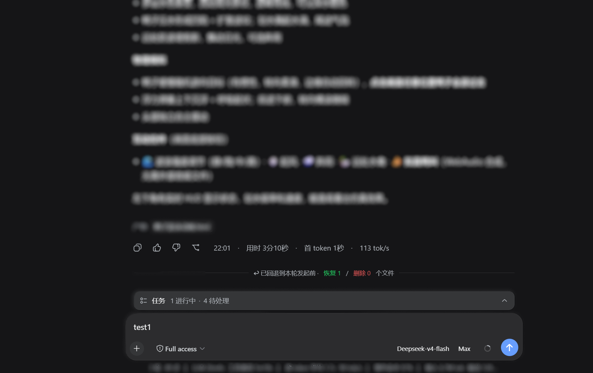

> 🌐 语言 / Language: **中文** · [English](./README.en.md)

# dsh-rollback · TRAE 式「回退」插件

为 [DeepSeek Harness](https://github.com/deepseek-ai/deepseek-harness)（DSH）Web 端提供一个 TRAE 式「回退到本轮对话发起前」的插件：按轮次建立检查点，一键把【工作区文件】和【模型上下文】同时回退到某一轮发起之前，保持同一会话 id。

## 是什么

`dsh-rollback` 忠实实现了 TRAE 回退功能的核心设计思想——**对话状态与文件状态对齐回滚**：

- 模型行为由「对话历史」和「工作区文件」共同决定，因此回退必须**同时**回滚两者，否则会出现幻觉延续或状态冲突。
- 回退 = 恢复该轮及之后触碰过的文件（修改→写回原内容，新建→删除）+ 原位截断对话历史（同一 session id，模型不再看到被截断的内容）。

## 功能特性

| 能力 | 说明 |
| --- | --- |
| 按轮次检查点 | 每轮发起前建立检查点，只记录该轮实际触碰的文件（Copy-before-Write 前置内容），非全量快照 |
| 10 轮滑动窗口 | 借鉴 TRAE「仅最近 10 轮」，超出窗口的检查点被丢弃 |
| 文件回退 | 修改过的文件写回本轮前内容；本轮新建的文件被删除；无法恢复的文件单独报告跳过 |
| 原位截断 | 用 **`user/message` 承载的表层 `replace`**（内置 `/compact` 同款官方原语）就地替换模型上下文，**回退当场即生效**，保持同一 session id |
| 三种触发入口 | 模型工具 `rollback`、人工命令 `/rollback`、Web 端每条已完成回复的「回退」按钮 |
| 受影响文件列表 | Web 按钮弹出对话框，列出本轮及之后受影响文件及动作（恢复/删除/跳过），点击文件可在编辑器打开 |

## 快速上手

### 安装

```sh
dsh plugin --profile web add @domitor-syh/dsh-rollback
```

然后重启 `dsh web`。从源码运行 DSH 时：

```sh
pnpm dsh plugin --profile web add @domitor-syh/dsh-rollback
```

### 使用

1. **Web 按钮**：每条已完成 AI 回复下方、与「赞/踩」并排的动作条里出现 ↩「回退」按钮 → 弹出受影响文件列表 → 确认回退。
2. **人工命令**：输入框键入
   - `/rollback list` — 列出可回退到的轮次
   - `/rollback preview <n>` — 预览回退到第 n 轮前会影响的文件（不执行）
   - `/rollback <n>` — 回退到第 n 轮发起之前
3. **模型工具**：AI 可自主调用 `rollback`（传 `turn` + 可选 `preview: true`）。

## 界面预览

1. **回退按钮**：每条已完成 AI 回复下方动作条里的 ↩ 按钮（与「赞/踩」并排）。

   

2. **回退弹窗与文件修改提示**：点击 ↩ 后弹出确认框，逐条列出受影响文件及其动作——修改过的写回原内容、新建的删除（无法恢复的单独标「跳过」）。

   

3. **被回退的消息从对话流中隐藏**：确认后被回退的消息立刻隐藏（不渲染分隔线，模型侧同样不留任何痕迹）；被回退那一轮的用户文本 / 图片自动回到输入框，方便接着改。

   

4. **回退首条消息的界面**：回退到第一条消息之前时，对话区显示「已回退到对话发起前」欢迎页。

   

## 架构

| 文件 | 职责 |
| --- | --- |
| `src/core/` | 纯逻辑（无 DSH 依赖）：检查点模型、捕获合并、回退规划、截断规划、滑动窗口、会话折叠，全部单测覆盖 |
| `src/service.ts` | Host 侧执行：`tools/result` 捕获写/改的前置内容 + `session/event` 折叠轮次；执行恢复/删除/截断 |
| `src/index.ts` | 插件体（Host 半侧）：注册 `rollback` 工具与 `/rollback` 命令 |
| `src/client/index.ts` | 浏览器半侧：官方 `assistant-actions` 槽的「回退」按钮 + 受影响文件对话框 + 本地化，经已出厂 `commands` Remote 触发宿主 |

关键实现点：

- **前置内容捕获**：`write`/`edit` 工具的执行结果里已带 `before`/`after`，通过 `ctx.on('tools/result')` 取到完整前置内容（会话日志里只有 3 行上下文 diff，不足以还原文件——所以必须用 live 结果）。
- **原位截断**：对当前 `session.surface.nodes` 中「第 n 轮及之后」的连续节点，append 一个 **`user/message`** 表层 `replace`（`surfaceOp: { op:'replace', start, end }` + `sourceEventSeqs` 覆盖所有被遮蔽节点），就地替换这段历史；会话 id 不变。
  - **借的是官方那把刀**：DSH 自己就是用「`user/message` + 表层 `replace`」重写模型可见历史的——内置 `/compact` 的检查点（`compaction-basic`）与 `tool-result-pruner` 都是这个形状，所以这不是旁路，而是官方原语。
  - **回退当场落盘**：`user/message` 是唯一不受会话不变式约束的消息类事件，**可以在轮次之间 append**（不需要已开启的 turn/step），因此标记在 `/rollback` 执行的那一刻就写进日志——被回退区间立即隐藏、欢迎页立即出现，刷新页面也不会让消息复活。
  - **为什么不用「空 `assistant/message`」（模型侧完全无痕那个方案）**：空内容 assistant 确实被 `deriveMessages` 投影为 null、模型看不到，但 DSH 只接受它**处于已开启的 step 内**；而轮次之间没有 step，自建 step 又不可能——step 编号必须严格等于 agent loop 的下一个编号（顺序不变式），我们占掉之后 loop 自己的 `step/start` 会失败、整轮崩掉。自造 turn 更糟：插件与 agent loop 各自维护「下一个轮次号」，撞号会在日志里产生两个同号 `turn/start`，Web 客户端装配对话树时直接抛错、历史窗口构建失败、该会话再也打不开。
  - **代价（有意换取）**：模型会看到这段检查点文字。措辞照抄 DSH 原生 compaction 的框架——明说这是什么、并指示模型不要提及——所以模型不需要猜、也不会当成待办；被回退的内容本身则**完全不在**模型历史里（表层 `replace` 已把它们移除）。
  - 回归测试：`tests/truncation-plan.test.ts`（含「不得退回 assistant/message 或任何需要 step 的形状」的守卫用例）。
- **客户端传输**：不引入自定义 Typert 构建，复用已出厂 `ctx.remote.commands.execute` 调 `/rollback …`。

## 已知限制（Known Limitations）

- **聊天记录仍显示已回退消息**：DSH 的人类聊天记录按 append-origin 事件渲染（与内置 compaction 的行为一致），表层 `replace` 只截断**模型上下文**。插件在 UI 层把被回退区间的消息隐藏，由日志里的持久标记驱动（回退当场即生效，刷新/重启后依然隐藏）。界面上**不渲染任何分隔线或回退提示**（把整段对话回退掉时显示欢迎页）。
- **模型会看到一行检查点文字**：这是「回退当场生效 + 刷新不丢」的代价。模型侧完全无痕的方案要求把标记放进一个已开启的 step，而轮次之间做不到（见上方「为什么不用空 assistant/message」）。该文字与 `/compact` 的检查点同类、并明确指示模型不要提及；每条约 60 token，反复回退到第一条消息时只保留一条（新标记的替换范围会覆盖旧标记）。
- **检查点为进程内存态 + 20 轮 sidecar**：会话内的折叠状态随会话对象存于 in-memory（`WeakMap`），重启后由 sidecar（`storages/dsh-rollback/checkpoints-v2/`）重建——`seedFromLog` 会重放日志并用 sidecar 里的完整前置内容还原历史检查点，保留窗口为最近 20 轮（`KEEP_TURNS`），超出窗口的记录在加载时被剪枝。
- **新建文件删除走本地文件系统**：文件系统抽象层没有删除原语，删除通过 `processPath` + Node `unlink` 完成，仅对本地后端可靠。
- **回退不可撤销**：执行即截断，与 TRAE 语义一致，不做 redo 链；对话框的受影响文件预览是该风险的补偿交互。
- **命令副作用不在回退范围**：`npm install`、写数据库、发请求等外部副作用无法回退（所有 checkpoint 方案的天然边界）。

## 开发

```sh
pnpm install        # 安装依赖（prepare 会先构建一次）
pnpm build          # 从 src/ 产出 lib/index.js、lib/invariant.js、lib/client.js
pnpm test           # 运行核心逻辑（src/core/）单测
pnpm typecheck      # tsc 检查 core + tests；scripts/typecheck-host.mjs 再检查
                    #   src/service.ts、src/index.ts、src/client/index.ts
                    #   （这三个文件 import 的 @deepseek-ai/* 不在本仓库安装，
                    #     故只忽略这些包造成的 TS2307/TS7006/TS7016，
                    #     其余一律视为真错误——含 TS2304「未定义标识符」）
pnpm deploy:profile # 打包并部署到 DSH profile（默认 web），随后需重启 DSH
```

> ⚠️ **改了代码必须 `pnpm deploy:profile`**：DSH 不是从本仓库加载插件，而是从 profile 的
> `node_modules` 加载 `file:` tarball 解出来的副本（见 `scripts/deploy-profile.mjs` 的说明）。
> 只跑 `pnpm build` 改的是本仓库的 `lib/`，**运行时毫无变化**。脚本会打包、更新 profile 引用的
> tarball、覆盖已解出的副本并校验字节一致，最后提醒重启 DSH 与刷新页面——而**重启必须由你手动做**：
> 宿主半侧在启动时载入，脚本无法替正在运行的进程换代码。

## 许可证

[MIT](./LICENSE)