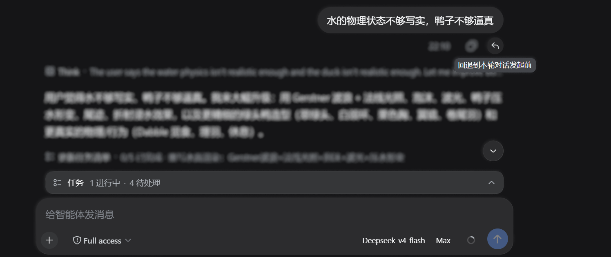
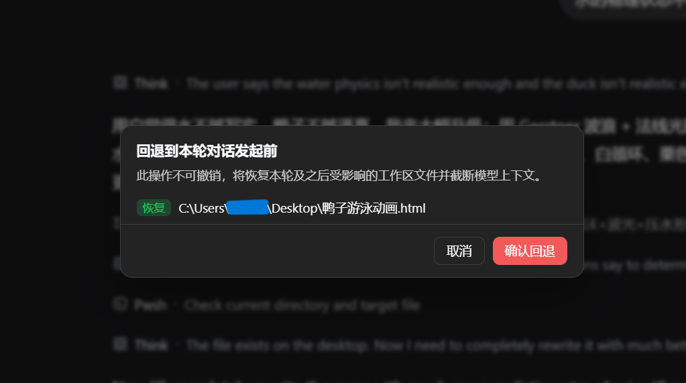
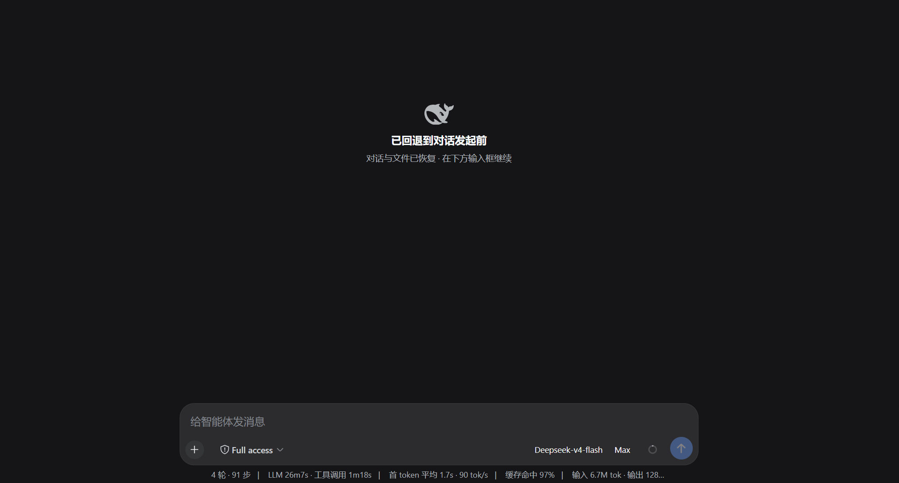

<div align="center">

# dsh-rollback · TRAE 式「回退」插件


> 🌐 语言 / Language: **中文** · [English](./README.en.md)

[](https://awesome-dsh-plugin.com) [](https://awesome-dsh-plugin.com) [](https://www.npmjs.com/package/@domitor-syh/dsh-rollback) [](https://www.npmjs.com/package/@domitor-syh/dsh-rollback) [](./LICENSE) [](https://github.com/domitor-syh/dsh-rollback/actions/workflows/test.yml)

</div>

为 [DeepSeek Harness](https://github.com/deepseek-ai/deepseek-harness)（DSH）Web 端提供一个 TRAE 式「回退到本轮对话发起前」的插件：按轮次建立检查点，一键把【工作区文件】和【模型上下文】同时回退到某一轮发起之前，保持同一会话 id。

## 是什么

`dsh-rollback` 忠实实现了 TRAE 回退功能的核心设计思想——**对话状态与文件状态对齐回滚**：

- 模型行为由「对话历史」和「工作区文件」共同决定，因此回退必须**同时**回滚两者，否则会出现幻觉延续或状态冲突。
- 回退 = 恢复该轮及之后触碰过的文件（修改→写回原内容，新建→删除）+ 原位截断对话历史（同一 session id，模型不再看到被截断的内容）。

## 兼容的 DSH 版本

最新发布（**0.3.1**）在各已发布 DSH 构建上的情况；清单取自 npm registry 上的 `@deepseek-ai/dsh`，覆盖截至本次发布已发布的全部构建：

| DSH 版本 | 状态 | 说明 |
| --- | --- | --- |
| 0.1.5-rc.2 | **已实测** | 本次发布适配并逐项验证的构建：回退、截断、文件恢复、欢迎页、隐藏、图片回填都在它上面端到端跑通 |
| 0.1.1-rc.2 | 按设计支持，**未实测** | 插件为这一代契约保留了特性探测回退分支：已退役的 `conversationEvents` 服务、快照上的 `session.chat`、旧拼写的表层 `start`/`end`、`workspaces.openPath`、`addImages`/`pruneImages`。本机没有 0.1.1 的构建，这条路径**没有在真实运行 0.1.1 的机器上跑过**——它是设计上的回退，不是实测结论 |
| 0.1.1-rc.1、0.1.2-alpha.2–alpha.5、0.1.2-rc.1、0.1.3-alpha.2、0.1.5-alpha.1/alpha.2/rc.1/rc.3、0.1.6-alpha.1/alpha.2、0.1.7-alpha.1/alpha.2/rc.1 | **未验证** | 没有在这些构建上跑过，包括同属 0.1.5 线、晚于 0.1.5-rc.2 发布的 `0.1.5-rc.3`。某个构建若改了契约，插件不会静默失败：它会在控制台点名报错（见下），隐藏逻辑 fail-closed，最坏只退化成「不隐藏」这一外观影响。要在这些版本上试，请挑一个可以丢弃的会话 |
| 0.0.1-rc.1/rc.2/rc.5、0.1.0-rc.2/rc.3/rc.6/rc.7/rc.8（低于 0.1.1），以及 0.2.0 及以上（尚未发布） | 不支持 | 低于 0.1.1 没有上述回退所覆盖的契约；0.2.0 起契约可能变化，未做适配。这些版本中，低于 0.1.1 的落在 `dsh.engines.dsh`（`>=0.1.5-rc.2`）的下界之外；0.2.0 及以上至今没有任何已发布构建 |

- 在 DSH **0.1.5-rc.2** 上装 **0.3.x**。**不要**把 0.1.0–0.2.2 装到 0.1.5 上：那一代在 0.1.5 上会**弄坏会话加载**——客户端半边把已不再存在的 `conversationEvents` 服务写进必需注入，于是永远停在 pending（表现是「装了什么也没发生」）；宿主半边则在框架恢复会话时从 `session/created` 观察者里抛错（0.1.5 不再交出 `session.events`），结果是会话打不开、对话区渲染为空。
- 在 DSH **0.1.1-rc.2** 上，0.1.0–0.2.2 正是为它开发和验证的一代，因此 **0.2.x 是实测最多的选择**；0.3.0 也按设计兼容（用的就是上表列出的旧契约回退分支），只是没有在 0.1.1 构建上跑过。

框架契约和插件预期不一致时，插件**大声报错而不是静默失败**：浏览器控制台会打印 `[rollback] framework contract mismatch: …` 或 `[rollback] hiding disabled for this pass: …`。界面隐藏逻辑是 **fail-closed** 的——聊天结构读不出来时它**什么都不隐藏**，并把此前隐藏的内容全部交还，所以未来的框架改动最多退化成「不隐藏」（纯外观影响），永远不会把对话区清空。宿主半侧把它注册的每个观察者都包在自己的 try/catch 里，所以插件出错不会影响宿主自身的会话加载。

`package.json` 里的 `dsh.engines.dsh` 为 `>=0.1.5-rc.2`——一个没有上界的开区间，因为 0.2.0 至今没有任何已发布构建，写死上界等于声明一个并不存在的约束。DSH **不读取**这个字段（它是给人和其他工具看的元数据）；而且 npm 的 semver 预发布规则让单个区间无法干净地同时覆盖 `0.1.1-rc.2` 和 `0.1.5-rc.2`——所以上面这张矩阵才是权威说明。

## 功能特性

| 能力 | 说明 |
| --- | --- |
| 按轮次检查点 | 每轮发起前建立检查点，只记录该轮实际触碰的文件（Copy-before-Write 前置内容），非全量快照 |
| 10 轮滑动窗口 | 借鉴 TRAE「仅最近 10 轮」，超出窗口的检查点被丢弃 |
| 文件回退 | 修改过的文件写回本轮前内容；已被删除的文件放回来；本轮新建的文件被删除；无法恢复的文件单独报告跳过 |
| 原位截断 | 用 **`user/message` 承载的表层 `replace`**（内置 `/compact` 同款官方原语）就地替换模型上下文，**回退当场即生效**，保持同一 session id |
| 两种触发入口 | 人工命令 `/rollback`、Web 端每轮结束后的「回退」按钮（正常轮次在回复的动作条上；被中断的轮次在轮次页脚） |
| 受影响文件列表 | Web 按钮弹出对话框，列出本轮及之后受影响文件及动作（恢复/找回/删除/跳过），点击文件可在编辑器打开 |
| 运行中禁止回退 | 只要有一轮还在跑就整体拒绝，必须等它结束或暂停（运行中的轮次本来也不会出现按钮） |

## 快速上手

### 安装

```sh
dsh plugin --profile web add @domitor-syh/dsh-rollback
```

然后重启 `dsh web`。从源码运行 DSH 时：

```sh
pnpm dsh plugin --profile web add @domitor-syh/dsh-rollback
```

### 使用

1. **Web 按钮**：每条已完成 AI 回复下方、与「赞/踩」并排的动作条里出现 ↩「回退」按钮 → 弹出受影响文件列表 → 确认回退。
2. **人工命令**：输入框键入
   - `/rollback list` — 列出可回退到的轮次
   - `/rollback preview <n>` — 预览回退到第 n 轮前会影响的文件（不执行）
   - `/rollback <n>` — 回退到第 n 轮发起之前
3. **不提供模型工具**：模型自己调用回退必然发生在"某一轮进行中"，而运行中一律禁止回退，所以这个工具无法成立，已移除（回退始终由人发起）。

## 界面预览

1. **回退按钮**：每轮结束后出现——正常轮次在回复下方动作条里（与「赞/踩」并排）；**被中断的轮次**在轮次页脚（那一轮没有收尾回复，动作条上不可能有按钮）。运行中按钮保留但置灰。

   

2. **回退弹窗与文件修改提示**：点击 ↩ 后弹出确认框，逐条列出受影响文件及其动作——修改过的写回原内容（`恢复`）、被删掉的放回来（`找回`）、新建的删除（`删除`）、无法恢复的标「跳过」。

   

3. **被回退的消息从对话流中隐藏**：确认后被回退的消息立刻隐藏（界面上不渲染分隔线）；被回退那一轮的用户文本 / 图片自动回到输入框，方便接着改。

4. **回退首条消息的界面**：回退到第一条消息之前时，对话区显示「已回退到对话发起前」欢迎页。

   

## 架构

| 文件 | 职责 |
| --- | --- |
| `src/core/` | 纯逻辑（无 DSH 依赖）：检查点模型、捕获合并、回退规划、截断规划、滑动窗口、会话折叠，全部单测覆盖 |
| `src/service.ts` | Host 侧执行：`tools/result` 捕获写/改的前置内容 + `session/event` 折叠轮次；执行恢复/删除/截断 |
| `src/index.ts` | 插件体（Host 半侧）：注册 `rollback` 工具与 `/rollback` 命令 |
| `src/client/index.ts` | 浏览器半侧：官方 `assistant-actions` 槽的「回退」按钮 + 受影响文件对话框 + 本地化，经已出厂 `commands` Remote 触发宿主 |

关键实现点：

- **前置内容捕获**：`write`/`edit` 的执行结果里已带 `before`/`after`，用 `ctx.on('tools/result')` 取完整前置内容；`str_replace_editor` 的结果只有渲染文本，改由 `tools/pre-execute` 在调用前预读目标。
- **盘根写入兜底**：Windows 上文件工具无法操作盘符根目录**正下方**的文件——文件系统层写前会先 `mkdir` 父目录，而 `dirname('E:\\file.txt')` 是**带尾分隔符**的 `E:\`，Windows 对卷根 mkdir 返回 EPERM。插件包装 `ctx.fs.writeText` 与 `ctx.fs.editText`：**仅当原路抛出这一精确形状的错误时**，改用「同目录临时文件 + `rename`」落盘（不做 mkdir 预检）。`edit` 分支还逐字复刻了字面匹配语义（`FS_EDIT_NOT_FOUND` / `FS_AMBIGUOUS_EDIT` 的判定与文案）并保留原文件的**行尾风格**与权限位；只包装后端实际实现了的方法。其余错误、以及策略不允许的路径（fail closed）一律按原样抛出。文件系统层若不再预建目录，该分支自动失效。
- **空目录清理**：回退删掉它创建的文件后，把「**已被清空、且创建时间落在被回退时间段内**」的祖先目录一并删除（最深优先；把本次即将删除的子目录视为已不存在，所以整条新目录链会一起清掉）。创建时间用于区分两种情况：目录在第 3 轮创建、文件在第 5 轮创建时——回退到第 5 轮之前**只删文件、保留目录**，回退到第 3 轮之前**两者都删**。创建时间不可得、目录不可读、或仍有内容时一律保留（fail closed）。
- **边界重扫 + 最后已知内容**：捕获只看得到文件工具，所以插件**在每一轮结束时（以及每条用户消息到来时）**复查它监视过的那些路径（状态指纹不变就只 stat、不读），把「被 shell 改写」或「被 shell 删除」的变化记到**该轮**上——模型删完、这一轮一结束就已经记录，**不需要你再多发一条消息**；回退到该轮之前即可恢复（回退在规划前会等待正在进行的扫描，避免"刚结束就回退"的竞态）。判定是 fail-closed 的：内容从未被读过就消失的文件**不记录**（记了也只会在恢复阶段被标为无法恢复，而**任何一个无法恢复的文件都会中止整次回退**），只报一次警告；超过 8MiB 的文件不再监视而不是假装能恢复；回退成功后注册表只清"内容记忆"、**保留路径继续监视**（否则回退会悄悄丢掉覆盖）。
- **写入偏好提示**：向模型注入一条常驻运行说明——只有被 `write`/`edit` 触碰过的文件才进入回退跟踪，改内容请用这两个工具而不是 shell。
- **原位截断**：对当前 `session.surface.nodes` 中「第 n 轮及之后」的连续节点，append 一条 **`user/message`** 表层 `replace`（`surfaceOp: { op:'replace', start, end }` + `sourceEventSeqs` 覆盖全部被遮蔽节点），就地替换这段历史；会话 id 不变。
  - 标记在 `/rollback` 执行时**当场**写入日志，被回退区间随即从模型历史中消失。
  - 标记内容是一段自动生成的检查点说明，并指示模型不要提及它；再次回退到同一点时，新标记的替换范围覆盖旧标记，只保留一条。
- **界面隐藏**：客户端按标记的替换起点，把被回退区间内的聊天座位隐藏（`display:none`）；隐藏由日志里的持久标记驱动，刷新/重启后保持。
- **回退标签分四类**：`恢复`（文件还在，写回旧内容 · 绿）、`找回`（文件已被删除，重新放回 · 蓝）、`删除`（撤销该区间新建的文件 · 红）、`跳过`（无法恢复）。前三者的区别由记录里的 kind 决定（`updated` / `removed` / `created`），所以"写回内容"和"把文件找回来"在数据上就是两件事。空列表**不再**显示"无文件变更"——插件看不见 shell 直接写出的文件，这种话它保证不了。
- **回退入口分两处，但**每轮只有一个按钮**：正常轮次的按钮仍在**助手回复的动作条**（你熟悉的位置）；只有**被中断的轮次**（没有收尾回复 → 动作条上不可能有按钮）才改由**轮次页脚**提供。页脚条目走官方 `conversation.chat.turnTail` 槽——它是 **chain** 槽，条目**必须提供 `select`**（缺了会抛错且界面毫无痕迹），`select` 返回 null 即不渲染，这正是"只在动作条无法提供时才出现"的实现方式；注册带 try/catch 并在控制台留痕，**不允许再出现"按钮静默消失"**。
- **运行中一律禁止回退**：只要有一轮处于打开状态就整体拒绝（`src/core/rollback-guard.ts`），无论目标是哪一轮。agent loop 持有表层位置并持续追加，在它下面截断会把"这一轮正在写的历史"遮蔽掉、而它更晚的输出还在；命令也不会打断运行，所以**拒绝本身**才是让两者不交错的原因。运行中的轮次**本来就没有按钮**（页脚节点要等该轮 `turn/end` 才存在，动作条要等助手消息收尾），所以这里只有一条规则、没有第二套禁用机制。
- **欢迎页**：把整段对话回退掉之后，由 driver 往对话区注入宿主元素，再用 React portal 把欢迎页渲染进去。
- **客户端传输**：复用已出厂 `ctx.remote.commands.execute` 调 `/rollback …`。
- **回归测试**：`tests/core.test.ts`（35）+ `tests/truncation-plan.test.ts`（10）+ `tests/root-write.test.ts`（14）+ `tests/root-write-fallback.test.ts`（15）+ `tests/literal-edit.test.ts`（12）+ `tests/dir-cleanup.test.ts`（15）+ `tests/empty-dirs.test.ts`（5）+ `tests/boundary-scan.test.ts`（10）+ `tests/boundary-rescan.test.ts`（13）+ `tests/boundary-pipeline.test.ts`（5）+ `tests/rollback-guard.test.ts`（10）+ `tests/turn-entry.test.ts`（3）。

## 已知限制（Known Limitations）

- **无法恢复的文件会被跳过，而不是中止整次回退**：某个文件恢复不了（前置内容从未记录，或文件系统拒绝：被占用、无权限、沙箱不允许恢复工作区外的路径）时，插件**照做能做的**、**对话照样截断**，并在结果里列出跳过项。这是刻意的取舍——之前"任何文件失败就整次中止"会导致：文件已部分恢复、对话没截断、而卡住的原因往往不会自己消失 → 反复失败 → 用户被彻底卡住。跳过项在**确认前**的预览里就标着「跳过」，所以是知情选择；而且**被跳过路径的记录会保留**，下次回退会再试一次（文件锁释放后就能恢复）✓
- **超出保留范围的回退目标会被拒绝**：检查点是 10 轮滑动窗口，更早的状态无法重建。GUI 里超出范围的按钮**置灰**（不额外加提示——置灰本身就是说明），命令返回报错并给出可回退范围——此前它会**静默按最旧的保留记录恢复**（错的状态、无提示）✗
- **聊天轨迹仍保留已回退的消息**：DSH 的聊天轨迹按 append-origin 事件渲染，而日志本身 append-only、无法改写；表层 `replace` 只作用于**模型上下文**。插件在界面层把被回退区间隐藏（由日志里的持久标记驱动，刷新/重启后保持）。
- **模型会读到一行检查点文字**：轮次之间写不出"模型不可见"的标记（那需要一个已开启的 step），所以模型会读到那段检查点说明，约 **34 token**（136 字符；压缩前是 331 字符 / 约 83 token）。这段文字**会一直留在模型上下文里直到本次会话结束**（只有下一次回退会替换它），所以每个后续请求都要付一次——因此措辞写到最紧，同时保住四件事：① 它是机器生成的、不是用户说的；② 此后的消息已移除；③ 工作区文件同时被还原；④ 从剩下的内容继续、**不要在意也不要提及这个检查点**。`tests/truncation-plan.test.ts` 用一条字符预算断言钉住它，防止以后又长回去。
- **检查点为进程内存态 + 20 轮 sidecar**：折叠状态随会话对象存于内存（`WeakMap`）；重启后由 sidecar（`storages/dsh-rollback/checkpoints-v2/`）重建，保留最近 20 轮（`KEEP_TURNS`），更早的记录在加载时被剪枝。
- **新建文件删除与空目录清理走本地文件系统**：文件系统抽象层没有删除原语，删除通过 `processPath` + Node `unlink`、空目录清理通过 Node `rmdir` 完成，仅对本地后端可靠。
- **回退不可撤销**：执行即替换历史，不提供 redo 链。
- **shell 新建的文件、以及从未被文件工具碰过的文件不在回退范围**：插件只从 `write`/`edit` 的结果里捕获改动，并在消息边界复查这些路径——所以「shell 改写了/删除了**已登记**文件」（含工作区外，如 `E:\`、桌面）**可以**回退；而「shell 新建一个全新文件」或「改动一个从未被工具碰过的文件」无法回退（后者连它存在过都不知道）。插件会注入提示引导模型改走文件工具，但无法强制。

## 开发

```sh
pnpm install        # 安装依赖（prepare 会先构建一次）
pnpm build          # 从 src/ 产出 lib/index.js、lib/invariant.js、lib/client.js
pnpm test           # 运行核心逻辑（src/core/）单测
pnpm typecheck      # tsc 检查 core + tests；scripts/typecheck-host.mjs 再检查
                    #   src/service.ts、src/index.ts、src/client/index.ts
                    #   （这三个文件 import 的 @deepseek-ai/* 不在本仓库安装，
                    #     故只忽略这些包造成的 TS2307/TS7006/TS7016，
                    #     其余一律视为真错误——含 TS2304「未定义标识符」）
pnpm deploy:profile # 打包并部署到 DSH profile（默认 web），随后需重启 DSH
```

> ⚠️ **改了代码必须 `pnpm deploy:profile`**：DSH 不是从本仓库加载插件，而是从 profile 的
> `node_modules` 加载 `file:` tarball 解出来的副本（见 `scripts/deploy-profile.mjs` 的说明）。
> 只跑 `pnpm build` 改的是本仓库的 `lib/`，**运行时毫无变化**。脚本会打包、更新 profile 引用的
> tarball、覆盖已解出的副本并校验字节一致，最后提醒重启 DSH 与刷新页面——而**重启必须由你手动做**：
> 宿主半侧在启动时载入，脚本无法替正在运行的进程换代码。

## 许可证

[MIT](./LICENSE)
