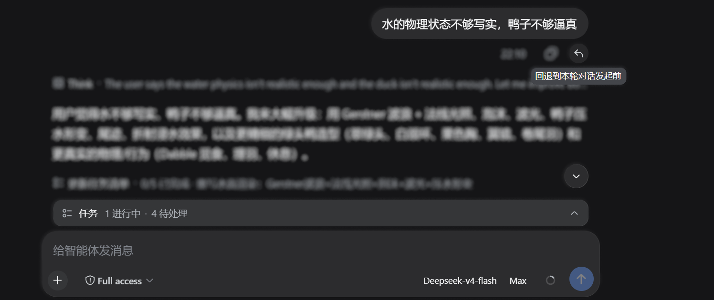
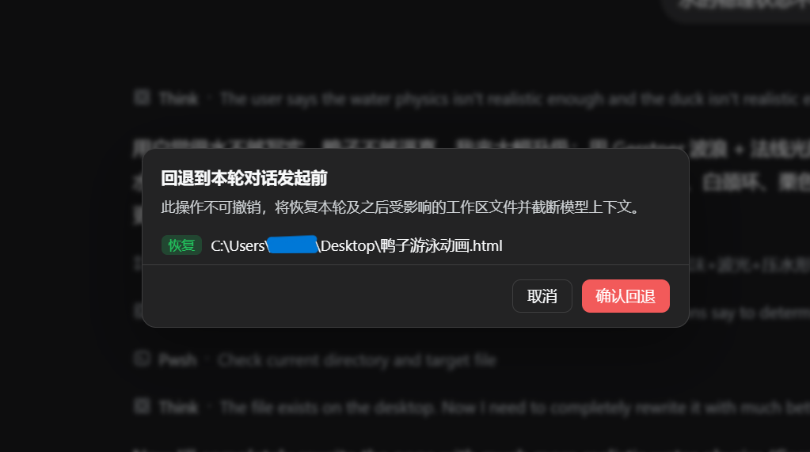
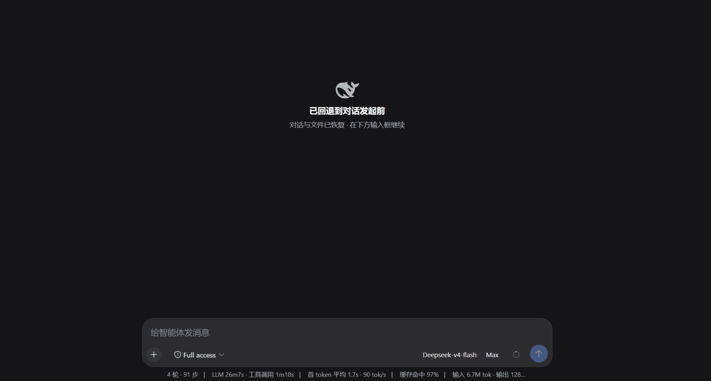

<div align="center">

# dsh-rollback · TRAE 式「回退」插件


> 🌐 语言 / Language: **中文** · [English](./README.en.md)

[](https://awesome-dsh-plugin.com) [](https://awesome-dsh-plugin.com) [](https://www.npmjs.com/package/@domitor-syh/dsh-rollback) [](https://www.npmjs.com/package/@domitor-syh/dsh-rollback) [](./LICENSE) [](https://github.com/domitor-syh/dsh-rollback/actions/workflows/test.yml)

</div>

为 [DeepSeek Harness](https://github.com/deepseek-ai/deepseek-harness)（DSH）Web 端提供一个 TRAE 式「回退到本轮对话发起前」的插件：按轮次建立检查点，在同一会话 id 内恢复**已跟踪、具备恢复依据且当前策略/后端允许的文件**，再替换对应的模型可见历史。它不是工作区全量快照或通用备份工具。当前实现仍属 **Unreleased**，本文不宣称已部署或完成真实 GUI 端到端验证。

## 是什么

`dsh-rollback` 的目标是**让已跟踪文件状态与模型可见对话状态对齐**：

- 模型行为由对话历史和文件共同决定；仅截断对话而保留未处理的文件改动会造成状态冲突。
- 回退规划区分写回旧内容、撤销创建与找回删除，再在同一 session id 内替换对应历史；执行要求完整恢复依据与当前策略/后端授权。现存普通文本文件可写回，受限本地普通文件可删除，缺失文件可在补偿删除获授权时找回（详见限制）。
- 当前执行采用 **all-or-no-truncate**：预检不完整就不开始；恢复 I/O 失败不会继续截断，但文件可能已部分改变，需要通过持久恢复日志重试或补偿。它不是跨多个文件的原子事务。

## 兼容的 DSH 版本

当前包版本仍为 **0.4.0**；本工作树的安全修订属于 **Unreleased**。下面区分「版本闸门放行」与「历史验证记录」：旧版测试记录不能证明这些未发布修订已经在真实桌面环境通过，安装 npm 包也不会自动得到工作树改动。

| DSH 版本 | 状态 | 说明 |
| --- | --- | --- |
| 0.2.0-rc.2 | 历史发布验证目标 | 0.4.0 的历史记录包含 `conversation.chat.turnTail` 的 list/`id` 适配与 `plugin:rollback` 标记来源修正；本次安全修订尚不据此宣称新的桌面端到端验证 |
| 0.1.5-rc.2 | 历史验证记录 | 早期发布记录包含文件恢复、截断、隐藏与图片回填验证；旧契约回落分支仍存在，但不等于当前安全修订已经在该构建复验 |
| 版本区间内的其他构建 | 可能被闸门放行，未验证 | 需逐构建检查宿主服务、事件、会话持久化与客户端槽契约，不能把放行当成恢复安全保证 |
| 0.1.1-rc.2 及其他低于下界的构建 | 当前声明不放行 | 存在旧契约读取分支并不意味着当前包承诺支持这些版本；旧版本选择请看历史更新日志 |
| 0.2.0-rc.1，以及 0.3.0 线及以后 | 当前声明不放行 | 不应通过版本豁免把未验证构建当作安全兼容目标 |

`package.json` 中的 `dsh.engines.dsh` 与 DSH peer 范围同为 `>=0.1.5-rc.2 <0.2.0-0 || >=0.2.0-rc.2 <0.3.0-0`。当前 DSH 装载闸门检查 `peerDependencies` 内的 `@deepseek-ai/dsh`、`@deepseek-ai/dsh-session`、`@deepseek-ai/dsh-invariants`，按运行时版本调用 `semver.satisfies(runtimeVersion, range, { includePrerelease: true })`；`dsh.engines.dsh` 只是对应元数据。两段区间覆盖声明的两条版本线，上界使用 `<0.2.0-0` / `<0.3.0-0` 排除下一条线的预发布版。

客户端遇到未知聊天结构或无效状态时应停止隐藏并报告诊断，而不是猜测；这不是「陌生版本最多只有外观问题」的保证。回退还依赖宿主持久化、文件策略与后端能力。这里**不宣称本次改动已发布到 npm、已部署到 profile 或已在运行中的 GUI 端到端验证**。

## 功能特性

| 能力 | 说明 |
| --- | --- |
| 按轮次检查点 | 围绕轮次折叠已观察的文件变更，保存完整前置内容；不是全量快照 |
| 10 轮滑动窗口 | 可选择目标限于最近保留轮次；恢复日志独立于目标窗口保留 |
| 文件回退 | 恢复有完整依据的普通文本文件；删除与缺失文件找回须通过受限本地删除授权，已知不可恢复项仍预检拒绝整次执行 |
| 原位截断 | 所有计划文件恢复完成后，追加 `user/message` 表层 `replace` 并等待宿主持久化确认，保持同一 session id |
| 两种触发入口 | 人工命令 `/rollback`、Web 端已结束轮次的「回退」按钮（正常轮次在回复动作条，被中断轮次在页脚） |
| 受影响文件列表 | 确认弹窗只读列出路径、动作与冲突提示；「跳过」表示不可恢复项并阻止执行，不表示忽略该文件；内容冲突警告本身不再拒绝已授权操作 |
| 运行中禁止回退 | 任何打开的轮次都会拒绝回退；历史按钮运行中置灰，当前轮次尚无结束按钮；存在待恢复事务时阻止模型及工具继续执行 |

## 快速上手

### 安装

```sh
dsh plugin --profile web add @domitor-syh/dsh-rollback
```

然后重启 `dsh web`。从源码运行 DSH 时：

```sh
pnpm dsh plugin --profile web add @domitor-syh/dsh-rollback
```

### 使用

1. **Web 按钮**：已结束轮次的 ↩「回退」按钮 → 读取受影响文件与会话版本 → 确认弹窗 → 执行。文件行是只读说明，不是导航入口。
2. **人工命令**：输入框键入 `/` 并选择 `/rollback`，或使用不带参数的命令 → 官方**轮次选择弹窗** → 选择目标 → **确认弹窗**。选择不会插入输入框文字，也不会直接执行。
   - 手动输入 `/rollback` 并按空格，蓝色命令生效后显示子命令补全菜单：实际命令为主标题、中文说明为辅助。选择只补全参数，保留命令状态，最后按回车执行；preview 打开轮次子菜单，Esc 返回并保持 preview 选中。原轮次弹窗只保留上一轮及轮次选项。
   - `/rollback latest` 直接执行当前检查点窗口中最近轮次；参数行无法通过现有 DSH decoration 打开确认弹窗，因此该命令和数字命令一样不显示客户端确认。没有可回退轮次时只返回错误，不改文件或对话。
   - 读信息的辅助命令：`/rollback list` 列轮次，`/rollback preview <n>` 预览已跟踪文件与版本，`/rollback state` 读取有限的会话绑定回退状态，`/rollback rescues` 列出已持久化的文件救援点元数据与路径（不自动恢复文件），`/rollback diagnose` 输出不含文件正文的诊断（事务阶段、检查点、策略及方法是否存在）；这些命令不恢复文件。diagnose 不探测删除/本地映射，不把方法存在当成恢复能力已验证；扫描/观测失败仍返回净化诊断且不清除失败状态，查询不可用报告 unknown。
   - I/O 或持久化失败后：`/rollback retry` 继续待恢复事务；`/rollback abort` 仅在标记尚未写入时**尝试**按真实操作前状态补偿，成功后保留对话。已授权内容冲突本身不再阻止 execute/retry/abort，但文件类型、路径、策略、会话、WAL 与受支持的读到写版本守卫仍有效；能力不足或守卫失败会保留日志，不能保证取消成功。标记已写入时只能重试完成持久化；`committed` 日志重试只完成收尾，不重新恢复文件。恢复不依赖目标仍在 10 轮选择窗口内。
3. **不提供模型工具**：回退始终由人发起；模型自己调用会发生在轮次进行中，与运行中禁止回退冲突。

确认弹窗的预览和提交绑定同一会话与版本；会话变化后必须重新预览。过期请求不应覆盖新会话/新弹窗的状态，执行期间关闭动作被禁用；关闭弹窗不等于取消宿主恢复事务。

## 界面预览

1. **回退按钮**：已结束轮次中，正常轮次在回复下方动作条里（与「赞/踩」并排），无收尾回复的被中断轮次使用页脚。运行时历史按钮置灰；当前未结束轮次还没有结束按钮。

   

2. **回退弹窗与文件修改提示**：点击 ↩ 后弹出确认框，规划可列出 `恢复`、`找回`、`删除`；「跳过」阻止整次执行。受影响文件动作旁显示缓慢闪烁的黄色圆点，减少动态效果设置下静态显示；底部中文警告准确为「警告:检测到文件有人为/外部应用修改痕迹，请谨慎回退」。警告是修改痕迹提示，不是可靠的修改者归因。截图仅说明历史界面，不是当前修订验证证据。

   

3. **被回退消息的界面隐藏**：宿主成功提交且客户端读到匹配会话的有效有限状态后，隐藏已确认撤回的消息，不渲染分隔线；确认路径尝试把该轮文本/可重建附件回填输入框，普通文件的历史字节回填已实现，不能保证所有附件恢复。

4. **回退首条消息的界面**：只有匹配会话的有效有限状态确认已撤回到起点时，才显示「已回退到对话发起前」欢迎页；未知或过期状态不授权它遮住当前对话。

   

## 架构

| 文件 | 职责 |
| --- | --- |
| `src/core/` | 无 DSH 依赖的检查点、捕获合并、恢复/截断规划、日志重放与界面身份判定；由单元测试覆盖相应规则 |
| `src/service.ts` | Host 侧观察文件工具与会话事件、等待边界扫描、版本校验、预检、恢复/补偿与截断提交 |
| `src/store.ts` | 完整文件前置内容 sidecar、按会话隔离的记录与独立回退后基线 |
| `src/transaction-store.ts` | 独立持久恢复日志，保存恢复目标及操作前真实文件状态 |
| `src/index.ts` | Host 入口：必需服务为 `fs`、`sessions`、`commands`、`sandboxPolicy`、`attachments`；注册人工 `/rollback` 命令，不注册模型工具 |
| `src/client/index.ts` | Web 入口：必需服务为 `slots`、`remote`、`remote.commands`、`locale`；按钮、轮次选择、确认弹窗与界面状态，经 `ctx.remote.commands.execute` 请求宿主；自动只读查询带 `--internal` 标记，内部回执不会显示为历史命令，用户手动只读命令仍可见 |

关键实现点：

- **前置内容捕获**：`write`、`edit` 与 `str_replace_editor` 经 `tools/pre-execute` 预读目标，在审批后的 `tools/execute` 再读实际存在状态/正文并丢弃旧前镜像，覆盖审批 waterfall 短路及审批等待期间修改；成功结果缺少可信前镜像时禁止回退，不信任工具自报的占位 `before: ""`。有效空内容仍保留。观察这些事件不需要必需注入 `tools`；捕获/持久化失败禁止回退，不改变工具自身错误传播。
- **盘根写入兜底**：`ctx.fs.writeText` 与 `ctx.fs.editText` 的 Windows 兜底只针对精确匹配的盘根 mkdir EPERM，仍需符合策略与后端条件。原服务成功时条件守卫原样透传；兜底的原生 rename 不提供条件发布，因此带创建/版本守卫的写入和带守卫的编辑会拒绝兜底，不会降级为无条件覆盖。回退恢复使用版本守卫，命中该错误时保留恢复日志且不继续截断。它不是一般文件错误的替代通道，也不能证明所有后端的本地路径映射。
- **目录保留**：事务执行不凭祖先目录出生时间自动清理目录；时间戳不能证明目录由本次轮次创建，回退后空目录可能保留。
- **工具派发范围与外部改动归属**：用户消息与轮次结束不再把磁盘差异记为当前轮修改；纯聊天及已知只读工具轮不会因此列出文件。外部改动保留为最后真实改文件轮次的冲突，不覆盖该轮 after，也不新增检查点。成功 `write`/`edit`/编辑器只记录目标路径，内容未变不新增变更；Shell/未知工具对已登记路径使用独立的派发前后快照，前镜像包含执行前的用户修改。direct 工具即使部分写入后报错，或写入成功后被后处理拒绝/取消，也按已捕获的目标前后态记录实际变化；只记录声明目标，不扫描归属无关路径。预览/执行等待观测完成，权限/I/O、非普通文件、超限、竞态或无法证明本地映射仍 fail-closed。后台/脱离派发修改、与工具同时发生的外部写入无法可靠归因；旧错误归属缺少来源证明，不自动迁移。
- **晚到结果与重放完整性**：直接文件工具成功结果绑定原派发轮次，即使该轮已结束也不会漏记或归到下一轮；无结构化后态的编辑器使用派发结束时已捕获的目标状态（包括 no-op），不在结果回调重新读取并吸收后续外部写入。新收据持久化 callId，重启逐轮逐调用验证覆盖，其他文件的检查点不能掩盖某个调用缺失的依据；下一轮开始前补入未正常结束的上一轮持久修改，直接改写调用同时缺少最终结果与精确收据时拒绝回退。旧无调用身份的收据仅在没有混合 shell/未知改写工具时按精确记录路径和足够原始收据数量兼容，不猜相对路径或补造前镜像；这不是旧来源归因证明。旧记录的相同修改可以重复发生，保留单文件中的所有出现次数，只按显式身份或旧/新文件之间的迁移副本数量去重。
- **跨度净变化归属**：目标跨度内每个路径只取首个 before 与最后一个 after；before 缺失/after 存在列为删除，before 存在/after 缺失列为找回，两者都存在且不同列为恢复。首尾相等（包括创建后删除、更新后还原）从文件列表和实际 I/O 中同时省略，即使之后又有外部改动；纯外部路径不新增，净受影响路径仍沿用现有冲突检查。执行 WAL 可选动作会保留预览标签以支持外部改动后的重试；缺失旧记录的 after 不能证明净变化为零，继续使用旧动作的保守恢复。Hero、菜单和右侧刻度条不因该归属规则改变；并发未知 shell 派发仍不能可靠区分外部修改者。
- **文件救援点**：成功提交回退后、清理事务日志前，独立保存 `rescues-v1` 文件救援点，记录事务真实 before/after；同 id 同内容重试幂等，冲突、损坏、版本/数量/大小超限拒绝覆盖并保留 WAL。它不是完整会话 redo、provider KV/remote memory 擦除或附件备份。
- **回退后基线**：每个成功恢复或补偿的路径通过 `resetAfterRollback` 安装精确内容/确认不存在，并独立持久化，避免死轮次过滤抹掉基线。只保留路径或清空内容记忆不足以保证继续跟踪；未来恢复仍需要有效记录、保留窗口与可用后端。
- **恢复事务与冲突预览**：按会话互斥，预览版本与提交版本必须一致；未知前置内容、不可恢复项及未获授权的删除/删除补偿拒绝预检。预览把实时内容与最后记录的 after 状态比较，并在可用时比较最后成功工具版本；版本记忆只在内存中，不可靠归因修改者，未观测修改、同内容修改和重启间隙仍可能漏检。已授权内容冲突本身不再拒绝 execute/retry/abort。操作前保存真实状态与 WAL，受支持的写入仍使用读到写版本守卫；失败保留日志并阻止模型/工具在混合状态上继续。卸载中止后续操作，跨实例进程内锁在旧执行退出前阻止新实例恢复。不是多文件原子事务；POSIX 日志同步目录项，Windows 仅面向进程崩溃恢复，不承诺突然掉电持久性。
- **原位截断与持久化**：文件恢复完成后，追加来源为 `plugin:rollback` 的 `user/message` 事件，以表层 `replace` 替换对应模型可见历史，使用 `startSeq`/`endSeq`，仅在明确形状拒绝时回落旧 `start`/`end`；`sourceEventSeqs` 覆盖被遮蔽节点，系统提示词不在替换区间。执行前和标记写入后都要求 `sessions.flush` 返回 `true`；观察者已被通知不等于落盘完成。已撤回的目标再次回退会被拒绝。
- **上下文压力计量**：可选读取 `ctx.get('tokenMeter')`，按实际表层顺序校验被替换区间并累加固定 `heuristicTokens`，同步相邻追加 `compaction/prune` 与标记，修正提供方用量锚定后的 projected pressure；不使用路由图片价格。缺失服务、异常或不匹配计量时退回原有标记路径；追加失败仍保留恢复日志。该协议在固定 rc.2 包的真实 codec/meter 内存回归验证，不等于所有放行版本或实时 GUI 验证，也不恢复 KV 缓存/擦除记忆。
- **有限界面状态**：`/rollback state` 返回带 `sessionId`、`version`、已撤回轮次与有限序号区间的结构，不是「从某轮起直到无限远」的边界。只按匹配会话、非过期状态及官方 `data-chat-turn` / 节点身份隐藏被撤回行；未知行保持可见，新轮次不会因旧数字边界被一并隐藏。客户端自动只读查询使用带 `--internal` 标记的 `list`/`state`/`preview`，仅隐藏明确带该标记的内部命令回执；用户手动输入的同名只读命令仍保持可见，React 管理的消息节点不被移除。
- **右侧轮次刻度条不处理**：保留宿主自己的轮次投影与布局，不隐藏、删除或重排刻度；遮蔽对话不会删除 append-only 日志中的轮次。
- **按钮槽**：正常轮次使用 `conversation.chat.assistant-actions`；无收尾回复的轮次使用 `conversation.chat.turnTail`。页脚先注册当前 list/`id` 形状，仅遇到明确的形状拒绝才回落历史 chain/`select`，两条路径都只在动作条无法提供时显示。
- **运行与弹窗守卫**：任何打开的轮次都拒绝回退（`src/core/rollback-guard.ts`），历史按钮运行中置灰。弹窗异步读取带请求身份，切会话/关闭会使旧请求失效；执行期间禁用关闭与重复确认，提交携带预览版本。
- **欢迎页与草稿回填**：有效匹配会话状态确认回退到起点且无剩余有效可见内容才显示欢迎页；已明确隐藏的回执/投影节点、官方不渲染的 permission/普通 context/system 节点与空 rollback-marker DOM 包装不阻挡有效空投影，Hero 只挂在外层聊天 flow；可见旧/新消息、手动只读回执及未知内容仍阻挡。按钮/确认路径尝试回填文本与可重建附件，直接数字命令不回填。普通文件回填已实现：Host 按轮次与附件 id 提供有界历史原始字节命令，经 `conversation.createDrafts` 以 `application/octet-stream` 二进制普通上传重建草稿，不复用回执或读取当前源路径；上限每文件 8 MiB、客户端合计 32 MiB。旧接口不支持时明确诊断，存储/上传失败也报告；不保证图片上传前不经过归一化。 当前固定宿主会把命令结果正文持久化到 `command/done`，因此有界导出会把附件字节的 base64 副本追加到持久会话日志；该回执属于日志而非模型可见表层。隐藏内部回执不删除这些字节，需考虑存储增长及日志分享/导出的隐私风险。
- **回归验证**：`pnpm test` 覆盖捕获合并、日志重放、基线、扫描、恢复事务、截断与客户端身份/请求规则；`pnpm typecheck` 检查核心、测试及 DSH 接口。以当前测试输出为准，不固定文件数或用例总数。模拟 DOM、探针与单元测试不等于在真实 GUI 的端到端验证。

## 已知限制（Known Limitations）

- **失败不等于已安全恢复**：不可恢复项仍阻止预检；I/O 开始后失败可能留下部分文件已变、对话未截断的混合状态。日志保留时先处理 `/rollback retry` 或 `/rollback abort`，不能假设报错已自动撤销写入。已授权内容冲突不再单独拒绝覆盖，但类型/路径/策略/会话/WAL 与受支持版本守卫仍会拒绝不安全操作；标记写入后不允许 abort。
- **本地删除有授权边界及残余竞态**：删除 helper 要求 Host 映射已证明，重复核验文件身份、原生规范路径与普通文件类型；允许 `danger-full-access` 和包含于工作区的 `workspace-write`，拒绝 `read-only`、受限策略下工作区外路径、远程后端、符号链接与目录。缺失文件找回现可执行，但补偿删除必须先获授权。宿主仍无版本条件原子删除保证；检查与原生删除之间有残余竞态，重复检查不能消除该风险。目录不自动清理。
- **超出保留范围的目标会被拒绝**：可选检查点为最近 10 轮滑动窗口，更早状态不能按最旧记录猜测重建；按钮会置灰，命令给出范围。独立事务日志用于恢复已经启动的操作，不增加新目标的可回退窗口。
- **聊天日志不是删除记录**：`replace` 改写模型可见表层，原 append-only 日志仍保留原消息，不能用回退来安全擦除敏感数据。客户端仅在读到匹配会话和版本的有限状态、并识别官方行身份时隐藏，刷新/重启后重新读取；未知契约或状态不可用时原消息可能保持可见，右侧轮次刻度不处理。
- **模型会读到检查点文字**：轮次间替换使用 `user/message`，不是模型不可见的标记；说明只针对本次已跟踪、实际可恢复的文件，不能理解为整个工作区均已还原。字符预算在 `tests/truncation-plan.test.ts` 检查，但 token 数取决于模型，后续压缩或回退也可能替换这段说明。
- **持久存储不是通用备份**：折叠状态在内存中，重启后借 sidecar 重建；检查点存储保留最近 20 轮供重建，仍只暴露 10 轮目标。新检查点与基线以会话 id 的 UTF-16LE 小写 hex 编码隔离，避免大小写不敏感文件系统碰撞；旧清洗文件名只作为按精确 session id 筛选的只读迁移来源。检查点与基线包含完整文件文本，恢复日志还包含操作前真实文本，位于 `DSH_HOME`（默认用户目录下 `.dsh`）的 `storages/dsh-rollback/`，无插件层加密；共享或同步该目录前考虑敏感内容。损坏、不可读或持久化失败会报告并阻止相关恢复，不能静默当成空状态。
- **恢复新鲜度与阻断轮次**：普通预览/提交版本仍严格校验。待恢复事务阻止模型执行时，真实循环可能已写入 inbox 并产生一个没有对话/工具活动的 blocked 空轮次；恢复只对完整、输入队列净变化为零的阻断生命周期放宽新鲜度，不把排队消息或真实活动当成可忽略变化。`committed` 日志重试只完成持久化/清理，不再次覆盖文件。
- **Windows 不承诺掉电恢复**：恢复日志有文件同步和原子替换；POSIX 另同步目录项，无法提供该屏障时会失败。Windows 上 Node 无法执行同样的目录同步，只提供进程崩溃恢复依据；**检查点、独立基线和恢复日志都不承诺 Windows 突然掉电持久性**，更不承诺整个工作区事务原子持久。
- **消息附件不能保证完整回填**：按钮/确认路径尝试回填文本、可读取图片及普通文件历史字节，受附件可用性、接口、存储、上传、大小预算和输入框状态限制；直接数字命令不回填。图片使用 `uiConversation.imageUrl`，草稿由 `conversation.createDrafts` / `addAttachments` 登记；图片上传前可能归一化，不承诺历史图片字节端到端不变。普通文件只从 Host 有界历史附件命令读取，不用旧上传回执或当前源路径替代；legacy 不支持时诊断，不伪造成功。没有 durable attachment 的路径参考芯片无法从显示文字重建；纯文本 `@路径` 最多恢复原文字，不额外塞入路径。
- **上下文回退不是缓存清除或记忆擦除**：本地消息投影重建不等于 provider 缓存 purge。下一次 wire 请求包含保留历史、回退 marker 与新提示，也可能因上下文/系统投影而变化；同一 sessionId 不是缓存命中保证。保留摘要、系统提示及插件/外部状态不保证还原。按每请求观察 input/read/write，读取比例为 `read/(input+read+write)`；原生 DeepSeek 字段为 `cache_read_input_tokens` / `cache_creation_input_tokens`，pi completions 使用对应别名，不能混淆字段语义或把本地重建当作远端 KV 擦除。
- **原始日志可能仍被使用**：已安装运行时的 `dsh_session_log` 扩展默认启用，可发送原始会话事件；遥测、日志导出和持久存储也可保留被遮蔽的内容。具体是否启用及是否接受发送取决于配置和提供方，本次未修改任何 profile 配置。成功提交清除的是恢复事务日志，不是检查点、独立基线、原始会话或提供方日志；恢复依据与「零痕迹」不能同时保证。
- **提交成功后没有 redo**：标记未写入时可通过日志尝试补偿；这不是提交成功后的撤销链。标记写入后 abort 被拒绝。
- **跟踪不是全盘覆盖**：只覆盖已登记路径、有完整基线且在保留窗口内的变更。已登记的普通 UTF-8 文本文件，在同步 shell 派发前成功保存完整实时内容、结束后确认删除时，可在策略允许下找回；不是所有 shell 删除都不可恢复。仅 `read` 看过或首次同内容写入不等于已登记。未登记文件、shell 首次新建、递归删除中的未知文件、派发结束后的后台删除、目录及二进制不能保证恢复。扫描拒绝含 NUL 或不能无损 UTF-8 往返的字节，不把替换字符当完整前镜像；仍受大小、有效记录、保留范围与当前策略约束。只在显式验证的本地路径映射上进行原生扫描，不凭工作目录猜测；工作区外路径同样必须符合当前策略。写入偏好提示只是引导，不强制模型使用文件工具。

## 开发

当前锁定的构建工具链要求 Node **`^22.18.0 || >=24.11.0`**。`package.json` 的 `engines.node: >=18` 只是包元数据，不代表 Node 18/20 可以构建这个工作树；请先确认实际运行 `pnpm` 的 Node 版本。

```sh
pnpm install        # 安装依赖；prepare 会构建，受相同 Node 前提约束
pnpm typecheck      # core/tests + scripts/typecheck-host.mjs 的 DSH 接口检查
pnpm test           # 运行当前回归测试；不等于真实 GUI 端到端验证
pnpm check:readmes  # 校验中英文结构与语言无关事实
pnpm build          # 只更新本仓库 lib/index.js、lib/invariant.js、lib/client.js
# 以下是独立的运行环境变更，不是文档检查的一部分：
pnpm deploy:profile # 仅适用于已配置 file: 包依赖的 profile；会写入该 profile
```

`pnpm build` 成功不等于运行中的 DSH 已加载新代码。对于 `scripts/deploy-profile.mjs` 支持的 `file:` profile，部署脚本打包并更新 profile 引用的 tarball 与已解出副本；这会改变实际安装，应单独确认目标 profile。之后还需**重启实际 DSH 宿主、刷新现有页面并核查加载版本/行为**。重启或页面刷新本身也不是端到端验证，字节一致只证明副本匹配构建产物。

只有确认同一实现 checkout 的 `pnpm run dev:web` 正在重建客户端插件 bundle 时，才可依赖其 HMR；普通构建/部署不会自动替换运行中 Host 的代码。这里列的是开发步骤，不代表本次工作已经构建、发布、部署或完成实时 GUI 验证。

## 许可证

[MIT](./LICENSE)
